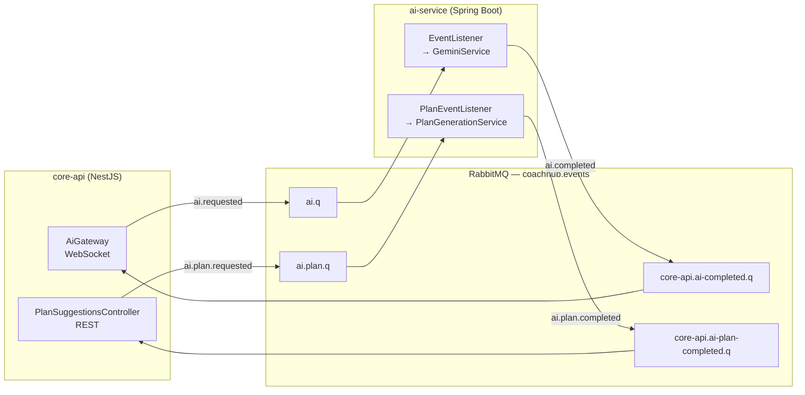
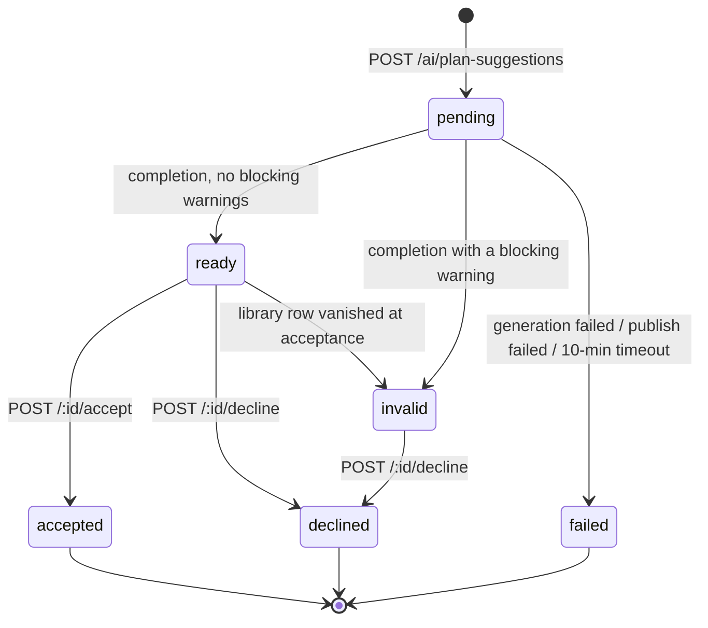

# The AI module, class by class

A code-level walkthrough of the AI feature across both services — what every file
does, why it exists, and where each rule is enforced.

Its companion, [`ai-service.md`](./ai-service.md), explains the *reasoning*: why a
plan is a selection problem, why one week instead of twelve, why RAG answers
questions but never designs plans. This document is the other half — the map you
read with the code open.

- **core-api** (NestJS, TypeScript) — `services/core-api/src/ai/`
- **ai-service** (Spring Boot, Java 21) — `services/ai-service/src/main/java/com/coachhub/ai/`

---

## 1. Two jobs, two paths, two queues

The module looks like one feature and is actually two, sharing only a Gemini
client and a message broker.

| | **Chat** | **Plan generation** |
|---|---|---|
| Trigger | WebSocket `ai.requested` | `POST /ai/plan-suggestions` |
| Shape | free text in, prose out | structured context in, JSON plan out |
| Duration | seconds | a minute or more |
| Grounding | RAG (vector retrieval) | Postgres (exact, member-scoped) |
| Result lives in | the socket frame, then gone | `ai_plan_suggestions` row |
| Queue | `ai.q` | `ai.plan.q` |
| Answer event | `ai.completed` | `ai.plan.completed` |

They are kept apart at every layer. Separate queues so a two-minute plan cannot
sit in front of an interactive question. Separate listeners, separate services,
separate sampling profiles. `RabbitMqConfig` explains the split in one line: *"They
are not the same kind of work."*



---

## 2. File map

### core-api — `src/ai/`

| File | Role |
|---|---|
| `ai.module.ts` | Wiring. 9 providers, 1 controller, 9 entities registered. |
| **Chat path** | |
| `ai.gateway.ts` | WebSocket gateway. Auth, validation, rooms, timeout. |
| `ai.service.ts` | Publishes `ai.requested`. 44 lines — it does one thing. |
| `ai-subject.service.ts` | **The security boundary.** Who may ask about whom. |
| `ai-completed.consumer.ts` | `ai.completed` → push to the socket's room. |
| `ai.controller.ts` | Vestigial (`@Controller('ai')`, body commented out). |
| **Plan path** | |
| `plan-suggestions.controller.ts` | The 5 REST endpoints. |
| `plan-suggestions.service.ts` | Request / list / findOne / accept / decline. |
| `plan-context.service.ts` | Builds the snapshot and the candidate library. |
| `ai-plan-completed.consumer.ts` | `ai.plan.completed` → resolve the row's status. |
| `plan-acceptance.service.ts` | Transactional build of the real plan. |
| `helpers/training-program.persistence.ts` | Plan JSON → program/week/day/exercise/set tree. |
| `helpers/nutrition-plan.persistence.ts` | Plan JSON → nutrition plan/day/meal/food tree. |
| `helpers/stale-plan-references.error.ts` | Carries the ids that vanished from the library. |
| `utils/plan-json.utils.ts` | Defensive readers for model-authored `jsonb`. |
| `utils/plan-suggestion.utils.ts` | Row → API shape (summary and detail). |
| `entities/ai-plan-suggestion.entity.ts` | The table, with 3 CHECK constraints. |
| `types/plan-suggestion.types.ts` | The shared contract types. |
| `dto/*.ts` | 4 DTOs — create, accept, decline, query. |

### ai-service — `com/coachhub/ai/`

| File | Role |
|---|---|
| **Transport** | |
| `config/RabbitMqConfig.java` | 2 queues, 2 DLQs, exchange, bindings. |
| `rabbitmq/EventListener.java` | `ai.q` → `GeminiService`. |
| `rabbitmq/PlanEventListener.java` | `ai.plan.q` → `PlanGenerationService`. |
| `rabbitmq/EventPublisher.java` | Wraps a payload in the shared envelope. |
| `rabbitmq/payload/*.java` | 7 records mirroring core-api's TypeScript types. |
| **Chat** | |
| `service/gemini/GeminiService.java` | Retrieve → ground the prompt → generate → publish. |
| **Plan** | |
| `service/plan/PlanGenerationService.java` | Orchestrates one generation end to end. |
| `service/plan/PlanPromptBuilder.java` | Renders the whole prompt (344 lines). |
| `service/plan/PlanResponseSchema.java` | The `responseSchema` Gemini is constrained by. |
| `service/plan/PlanValidator.java` | Checks the plan against what Postgres would reject. |
| **Gemini** | |
| `service/client/GeminiClient.java` | HTTP, retries, and turning a response into a result. |
| `service/client/GeminiProperties.java` | Config record: model, timeouts, retry, 2 profiles. |
| `service/client/GeminiDtos.java` | Request/response shapes. |
| `service/client/GeminiResult.java` | Text + finishReason + token counts. |
| `config/GeminiHttpConfig.java` | Timeouts, via `RestClientCustomizer`. |
| **RAG** | |
| `service/rag/RagService.java` | The interface and its three constants. |
| `service/rag/SpringAiRagService.java` | Atlas `$vectorSearch` with the tenant+member filter. |
| `service/rag/ingest/KnowledgeIngestService.java` | The scheduled diff-and-prune sync. |
| `service/rag/ingest/CoreDbKnowledgeReader.java` | 7 SQL sources out of core_db (593 lines). |
| `service/rag/ingest/CuratedKnowledgeReader.java` | `resources/kb/*.md`, split on `##`. |
| `service/rag/ingest/KnowledgeDocument.java` | One chunk; **content-hash id**. |
| `service/rag/ingest/RagIndexVerifier.java` | Asserts the Atlas index can actually filter. |
| `service/rag/ingest/Phrasing.java` | Renders rows as sentences, not column dumps. |
| **Storage** | |
| `domain/AiDocument.java` | Mongo record of every request this service handled. |

---

## 3. The NestJS side

### 3.1 `AiModule` — the wiring

```ts
imports: [ConfigModule, MessagingModule, AuthModule, TypeOrmModule.forFeature([...9 entities])]
controllers: [PlanSuggestionsController]
providers: [AiService, AiCompletedConsumer, AiPlanCompletedConsumer, AiGateway,
            AiSubjectService, ConfigService, PlanAcceptanceService,
            PlanContextService, PlanSuggestionsService]
```

The nine entities are worth noticing: `AiPlanSuggestion` is the module's own, and
the other eight — `ClientIntake`, `ClientMembership`, `Checkin`, `Exercise`,
`LoggedWorkout`, `Food`, `Meal`, `Measurement` — are all read by
`PlanContextService`. That list *is* the answer to "what does the model know about
this client".

### 3.2 `AiGateway` — the chat entry point

Four things happen here, in order.

**Connection.** `handleConnection` authenticates the socket through
`WsAuthService`, stores the resulting `WsPrincipal` on `client.data`, and — this
is the unusual part — **keeps the raw token too**:

```ts
client.data.principal = principal;
// Kept so every message can re-verify it; see onAIRequested.
client.data.token = this.wsAuth.extractToken(client);
```

**Re-authentication per message.** A socket can stay open for hours. A principal
captured at connect time would outlive a revoked token, a deleted coach, a
changed tenant. So `onAIRequested` starts by calling `reauthenticate`, which
re-verifies the stored token on *every single message* and disconnects if it no
longer holds.

**Validation.** Prompt non-empty and ≤ 4000 chars; `kind` non-empty; `clientId`
and `membershipId` must be UUIDs if present. Note the tri-state return from
`readMembershipId` — `string` (asked for), `null` (not asked for), `undefined`
(malformed). Three outcomes need three values; a boolean would have collapsed
"absent" and "invalid" into one.

**Authorization.** One line, and the only one that matters:

```ts
const subject = await this.subjects.resolve(principal, requestedMembershipId);
if (requestedMembershipId && principal.coachId && !subject) {
  this.reject(client, 'client not found in this tenant');
  return;
}
```

Then the request goes out, the socket joins a room named `ai:req:<requestId>`, and
a timeout is armed. The room is how the answer finds its way back — the completion
arrives on a *different* connection (a RabbitMQ consumer), so it needs an address,
and the request id is one.

The timeout is `unref()`d, deliberately:

> *Advisory only — a pending timeout should never be the reason the process stays
> alive.*

**Events this gateway emits:** `ai.accepted` (queued, here is your requestId),
`ai.completed` (the answer), `ai.timed_out`, `ai.rejected` (malformed, socket
stays open), `ai.unauthorized` (socket closes immediately after).

### 3.3 `AiSubjectService` — the security boundary

The smallest file in the module and the one with the longest comment, because
getting it wrong "does not produce a bad answer, it produces one client's notes
read out to another."

```ts
async resolve(principal: WsPrincipal, requestedMembershipId: string | null) {
  if (principal.clientId) {
    return this.findOwnMembership(principal.tenantId, principal.clientId);
  }
  if (!requestedMembershipId) return null;
  return this.findMembershipInTenant(principal.tenantId, requestedMembershipId);
}
```

Two rules:

- **A coach** may ask about any membership in their tenant — but the membership is
  verified *against the database*, with the tenant in the `where` clause. Without
  that clause a coach could read any client in the system by guessing a UUID.
- **A client** may only ask about themselves. Their `membershipId` is not
  validated and rejected — it is **never read at all**. The branch returns before
  the parameter is touched. There is no version of that field from a client that
  means anything, and accepting it even to reject it invites the check to be
  loosened later.

It lives in its own file so it can be read and tested on its own rather than
inline in a socket handler. A test asserts the client-supplied value never
reaches the query.

### 3.4 `AiService` — 44 lines

Generates a `requestId`, builds the payload, publishes `ai.requested`, returns the
id. That is the whole class. The comment on `tenantId` earns its place:

> *Taken from the caller's verified access token. This becomes the envelope's
> tenant, which is what ai-service scopes knowledge-base retrieval by — so it must
> never be defaulted or accepted from a request body.*

### 3.5 `PlanSuggestionsController` — the five endpoints

| Method | Path | Does |
|---|---|---|
| `POST` | `/ai/plan-suggestions` | Queue a generation. 201 immediately. |
| `GET` | `/ai/plan-suggestions` | List, newest first, paginated. Summaries only. |
| `GET` | `/ai/plan-suggestions/:id` | One suggestion **with** the plan. |
| `POST` | `/ai/plan-suggestions/:id/accept` | Build the real program/plan. |
| `POST` | `/ai/plan-suggestions/:id/decline` | Record the no, and why. |

The list/detail split is not cosmetic. `LIST_COLUMNS` explicitly omits `plan` —
it is the one field large enough to make a page of twenty expensive.

### 3.6 `PlanSuggestionsService`

**`request()`** — six steps, in this order:

1. Assert an active tenant.
2. Resolve the membership (active, in this tenant, with `client` joined).
3. **Expire stale pendings** — one UPDATE, not a read-then-write.
4. **Assert no pending** of this kind for this client.
5. Build the context; write the `pending` row.
6. Publish `ai.plan.requested`.

Step 3 is a single conditional UPDATE for a stated reason:

> *Two requests arriving together would otherwise both see the same stale row and
> both decide to replace it.*

Step 6 has a failure branch that matters: if the publish throws, the row already
exists, and leaving it `pending` would *promise an answer that is never coming*.
So it is failed inline with the broker error, and the caller gets a 503.

**`accept()`** re-resolves the membership rather than trusting the row:

> *A suggestion can sit for days, and building a program for a client who has since
> been archived is not something the schema stops.*

**`assertAcceptable()`** — the interesting rejection is `invalid`:

> *It means something in the plan would be rejected on insert, so letting it
> through would trade a clear 409 for a constraint violation partway through
> writing a program tree.*

**`decline()`** accepts only `ready` and `invalid` — never `pending` (nothing to
judge yet) or `failed` (already ended). Calling either of those a decline "would
put the coach's name on a decision they did not make."

### 3.7 `PlanContextService` — what the model gets told

Three parallel reads, then candidate selection.

```ts
const [intakeRow, measurementRows, history] = await Promise.all([
  this.findIntake(...), this.findMeasurements(...), this.findHistory(...),
]);
```

**The history read is the one to defend in a presentation.** It goes straight to
Postgres, not through the knowledge base:

> *This has to be* this client's *history and all of it: vector retrieval is scoped
> by tenant, so a similarity search could surface another client's check-in — and
> "the six most similar notes" is the wrong shape for a question whose answer is
> "the six most recent".*

Limits: 6 measurements, 6 check-ins, 10 sessions, 1000 rows read per library
table, 300 candidates carried per type.

**Equipment filtering is containment, not overlap:**

```ts
private isPerformable(required: EquipmentType[], allowed: Set<EquipmentType>): boolean {
  if (allowed.size === 0) return true;   // empty intake = don't filter
  return required.every((item) => allowed.has(item));
}
```

> *A barbell hip thrust tagged `{barbell, machines}` is no use to someone who only
> owns a bench.*

An exercise with no equipment is bodyweight and always passes — which falls out of
`every` on an empty array with no special case. `FULL_GYM` expands to every type;
anything else implicitly gains `NONE`.

**Allergen matching is whole-word and bidirectional**, and it exists because of a
real bug found in this database:

```ts
private mentions(phrase: string, term: string): boolean {
  const escaped = term.replace(/[.*+?^${}()|[\]\\]/g, '\\$&');
  return new RegExp(`(^|[^a-z0-9])${escaped}([^a-z0-9]|$)`).test(phrase);
}
```

An intake said *"Alergic to lactose"*. The food tag is `milk`. An exact match
found nothing, so four dairy meals were offered to a lactose-intolerant client.
The comment states the asymmetry plainly:

> *A spurious match removes a meal the client could have eaten, a missed one offers
> a meal that could hurt them. Those are not the same mistake, so the comparison is
> deliberately generous.*

Whole words, so `nuts` does not match inside `coconut`. And a meal's allergens are
the union of its own and every ingredient's — `meals.allergens` only holds what the
coach added on top.

### 3.8 `AiPlanCompletedConsumer` — resolving the row

Four guards before anything is written:

1. **No such suggestion** → drop it. *"Nothing to retry into existence — requeuing
   would loop forever."*
2. **Tenant mismatch** → log at `error`, drop.
3. **Not `pending`** → already resolved, ignore.
4. **Conditional UPDATE** on `{ id, status: PENDING }` — because two deliveries
   arriving together would both pass guard 3, and only one may win.

Then `resolveOutcome` maps the payload to a status:

| Payload | Status written |
|---|---|
| `status: 'failed'` | `failed`, with the error |
| `status: 'succeeded'`, no plan | `failed` — *"claimed success but carried no plan"* |
| succeeded, has a blocking warning | `invalid` |
| succeeded, clean | `ready` |

The second row is defensive against the database: a `ready` row with no plan
violates `ck_ai_plan_suggestions_ready_has_plan`, and the failed insert would put
the message back on the queue to fail forever. Naming it is cheaper.

Unknown severities normalise to `'error'` — fail closed. Warnings are capped at
100 as a backstop behind ai-service's own cap of 50.

### 3.9 `PlanAcceptanceService` — building the real thing

One transaction, both halves or neither:

```ts
return await this.dataSource.transaction(async (manager) => {
  const built = await this.build(manager, {...});
  const result = await manager.getRepository(AiPlanSuggestion).update(
    { id: suggestion.id, status: PlanSuggestionStatus.READY },   // conditional
    { status: ACCEPTED, decidedAt, createdProgramId, createdPlanId },
  );
  if (!result.affected) throw new ConflictException(...);        // rolls back the program too
});
```

> *A program written without the suggestion flipping to `accepted` would be a
> program the coach can accept again.*

**`StalePlanReferencesError`** is caught *outside* the transaction, on purpose. The
transaction is gone by then, so marking the suggestion `invalid` is a separate
write — and it has to be, "or the coach is left with a button that keeps failing
for a reason nothing on screen explains."

**Start date** resolves in the *client's* timezone:

> *A coach in Cairo scheduling for a client in Vancouver would otherwise hand them a
> plan whose first day is already over.*

**Week expansion.** The persistence helper repeats the designed week structurally
across `durationWeeks`, carrying the progression note onto each week. It does not
inflate reps, and the comment says why: expanding by arithmetic needs an operand,
and there isn't one — the model is never asked for a load in kilograms.

### 3.10 `plan-json.utils.ts` — reading what a model wrote

Every read of the stored plan goes through `readRecord` / `readArray` /
`readString` / `readInt` / `readNumber` / `readEnum` / `readBoolean` / `renumber`:

> *It has been through a schema and a validator, but it is still the only data in
> this codebase whose shape nothing in TypeScript guarantees — and it may have been
> written by an older version of either. Every read goes through here so that a
> surprise is a null rather than a `TypeError` thrown halfway through building a
> program.*

`readInt` rejects `8.5` because "8.5 reps is not a rep count."

### 3.11 `AiPlanSuggestion` — the table

Three CHECK constraints do real work.

**`ck_ai_plan_suggestions_accepted_result`** — a training suggestion can only
produce a program, a nutrition one only a plan, and nothing but an `accepted`
suggestion produces either. This is what makes `created_program_id` trustworthy as
an idempotency key: *if it is set, this suggestion was accepted, once.*

**`ck_ai_plan_suggestions_ready_has_plan`** — `ready`/`accepted` implies a plan
exists. Catches a consumer that marks a row ready without writing the plan.

**`ck_ai_plan_suggestions_decided_at`** — `decided_at` is set for exactly
`accepted` and `declined`, "not `invalid` or `failed`, which the system reaches on
its own."

`inputSnapshot` is stored rather than recomputed, and so are `warnings`:

> *What the coach saw when they accepted is a fact about that decision —
> recomputing later would show them today's answer to yesterday's question.*

The membership FK is `RESTRICT`, not `CASCADE` — a suggestion is part of the record
of what a coach was advised to do.

---

## 4. The Java side

### 4.1 `RabbitMqConfig` — the topology

Ten beans: one topic exchange (`coachhub.events`), two work queues with dead-letter
routing, one direct DLX, two DLQs, four bindings, and a JSON converter.

| Queue | Binds | DLQ |
|---|---|---|
| `ai.q` | `ai.requested` | `ai.dlq` |
| `ai.plan.q` | `ai.plan.requested` | `ai.plan.dlq` |

> *Sharing one queue means every plan blocks every question behind it, and the two
> cannot be scaled, retried or dead-lettered apart. Separating them costs four
> beans.*

Listener retry policy is in `application.yml`: 3 attempts, 2s initial, ×2,
capped at 10s, `default-requeue-rejected: false`.

### 4.2 The two listeners

`EventListener` and `PlanEventListener` are nearly identical and differ in one
telling way. Both convert the payload and delegate. But `PlanEventListener`
deliberately lets a conversion failure throw:

> *A payload this service cannot read is a poison message, not a transient fault —
> letting it throw sends it to the DLQ after the configured retries, which is where
> a malformed message belongs.*

Both log-and-ack an unrecognised `messageType` rather than requeuing: "requeuing a
message nothing here handles only spins."

### 4.3 `GeminiService` — the chat path

```java
AiDocument record = repository.findByRequestId(payload.requestId())
                              .orElseGet(() -> repository.save(AiDocument.received(payload, tenantId)));
if (record.getStatus() == AiDocument.Status.SUCCEEDED) return;   // idempotency

String prompt  = buildGroundedPrompt(payload, tenantId);
String summary = gemini.generate(prompt);
record.markSucceeded(summary);
publish(..., "succeeded", summary);
```

**Retrieval must never break generation.** `retrieveContext` catches everything and
degrades to no context — a knowledge base that is down produces a less-grounded
answer, not a failed one.

**The catch block never rethrows**, and the comment is the reason:

> *Re-delivery would emit duplicate `ai.completed` events. Transient-error retries
> belong behind the Gemini client, not the broker.*

That single decision is what makes `GeminiClient`'s internal retry load-bearing
rather than a nicety.

The grounded prompt is assembled plainly: a role line, `=== Context ===` with one
bullet per chunk tagged by source, then `=== Request (kind: …) ===` and the user's
words. No context found → the bare prompt goes through unchanged.

### 4.4 `PlanGenerationService` — the plan path

```java
String prompt = promptBuilder.build(payload);
AiDocument record = /* find-or-create by requestId */;
if (record.getStatus() == SUCCEEDED) return;

Map<String,Object> schema = PlanResponseSchema.forKind(payload.kind());
GeminiResult result = gemini.generateJson(prompt, schema);
JsonNode plan = objectMapper.readTree(result.text());
List<PlanWarning> warnings = validator.validate(plan, payload);
publish(AiPlanCompletedPayload.succeeded(payload, plan, warnings, meta(result, startedAt)), ...);
```

The idempotency check matters more here than in chat: a duplicate delivery would
be "a second full generation — by far the most expensive call this service makes —
for an answer core-api already has."

`meta()` is built **even on failure**, on purpose:

> *A request that burned the whole output budget and then truncated is the expensive
> kind, and that is exactly when it is thrown away.*

And the class-level comment draws the line between the services:

> *Nothing here decides whether a plan is usable. It reports what came back, what is
> wrong with it, and what it cost; core-api owns the suggestion's state and makes
> that call.*

### 4.5 `PlanPromptBuilder` — 344 lines of prose assembly

Sections, in order: client → measurements → **history** → brief → rules →
candidate library.

`appendHistory` is the newest section and the one that makes the plan react to
reality rather than to a profile. Notes are capped at 2000 characters each.

The rules block is numbered (7 for training, 6 for nutrition) and states the
non-negotiables in the model's own idiom — copy ids exactly, exactly seven days,
never invent an exercise, express intensity as RPE or RIR.

The candidate library is rendered last, as compact lines: id, name, and only the
attributes selection depends on.

### 4.6 `PlanResponseSchema` — constraining the output

An OpenAPI-subset schema (UPPERCASE types, `propertyOrdering`) handed to Gemini as
`responseSchema`, with `responseMimeType: application/json`. Two variants,
`training()` and `nutrition()`.

Every property is `required` and the optional ones are `nullable`:

> *…so the shape that comes back is always the same and the validator has one case
> to handle instead of two.*

`propertyOrdering` is not decoration — "a model filling a long object does it more
consistently when the order is pinned."

**What is deliberately absent:**

- No exercise names, categories, muscles, media or instructions. core-api copies
  all of that from the `exercises` row at acceptance, "so asking for it invites the
  model to describe an exercise differently from the library it came from."
- **No `weightKg`.** *"Nothing in the context says what this client can lift, so a
  number in kilograms would be invented — and invented load is the one field in a
  training plan that can actually hurt someone."* Intensity is RPE, RIR, or
  %1RM instead.

### 4.7 `PlanValidator` — checking against the schema that will store it

The severity split is mechanical, and stated as such:

> ***error*** *means a constraint would fail on insert — a missing foreign key, a
> day number outside 1-7, a set that prescribes nothing.* ***warning*** *means a
> coach might disagree. Nothing here guesses at programme quality; a validator that
> starts having opinions about rep ranges is one that cries wolf.*

| Check | Severity |
|---|---|
| `dayNumber` outside 1–7, or duplicated | error |
| Rest day with exercises / training day without | error |
| `exerciseId` or `sourceMealId` not in the offered candidates | **error** |
| Position or set number < 1, or duplicated | error |
| Set with both reps and duration, or neither | error |
| `repsMax` without `repsMin` | error |
| `intensityType` / `intensityValue` set apart | error |
| `servings` ≤ 0 | error |
| Training days ≠ what the coach asked for | *warning* |

`validateSetPrescription` mirrors the three CHECK constraints on `planned_sets`
one-for-one: *a set says what to do, it says it one way, and a rep ceiling needs a
floor.* `amrap`, `to_failure` and `drop_set` are exempt from needing a target.

The unknown-id check is the reason this class lives here at all — this service is
the only place that holds the candidate list. core-api re-checks every id at
acceptance against the *live* library. "Neither check replaces the other: this one
tells the coach immediately that the model went off-script, that one stops a stale
plan being saved."

Capped at 50 warnings: "A plan that has gone this wrong is not going to be salvaged
by reading warning 51."

### 4.8 `GeminiClient` — HTTP, retries, interpretation

**The retry loop** is the only retry in the system, and the comment explains why it
has to be:

> *The RabbitMQ listener deliberately does not rethrow — a redelivery would publish
> a second completion for the same suggestion — so without a retry here, a 503 that
> clears in two seconds costs a coach their whole plan.*

Retryable: any 5xx, 429, 408. Not retryable: everything else — "a bad key, a
retired model or a malformed request will fail exactly the same way on every
attempt." `ResourceAccessException` (timeout, reset) always retries, since no
response ever arrived.

Backoff is 3 attempts × 2s × 2.0 by default. The budget must stay under core-api's
10-minute pending window, "or a plan can arrive after the request has already been
written off as abandoned."

An interrupt mid-backoff restores the flag and gives up, "so a draining pod stops
instead of finishing a call nobody is waiting for."

**`interpret()`** replaces one generic error with five specific ones:

| Condition | Message |
|---|---|
| Null body | *Gemini returned an empty body* |
| `promptFeedback.blockReason` | *Gemini blocked the prompt (blockReason=…)* |
| No candidates | *Gemini returned no candidates* |
| Empty text + `MAX_TOKENS` | *produced no output before hitting maxOutputTokens — raise it, or lower thinking-budget* |
| JSON expected + `MAX_TOKENS` | *truncated its JSON at maxOutputTokens — the response is incomplete* |

> *The old "returned no candidates" covered four different failures that need four
> different responses from whoever reads the log.*

The last row exists because truncation is survivable for prose and fatal for JSON —
naming it beats handing the caller a Jackson "unexpected end of input".

**`GeminiHttpConfig`** sets the timeouts through a `RestClientCustomizer` rather
than in the client's constructor, and the comment records the bug that taught us:

> *A request factory set inside `GeminiClient` would overwrite whatever the caller
> had already put on the builder. That is not hypothetical: it is exactly how
> `MockRestServiceServer` works, so doing it there turns every client test into a
> real network call.*

### 4.9 RAG

#### `RagService` — three constants that are the whole design

```java
String TENANT_KEY  = "tenantId";
String GLOBAL_TENANT = "__global__";   // curated corpus, visible to every coach
String MEMBER_KEY  = "membershipId";
String NO_MEMBER   = "__none__";       // "not about one particular client"
```

Sentinels rather than absent fields, for a stated reason:

> *An Atlas filter can test equality against a value, and expressing "the field is
> missing OR equals X" is both awkward and easy to get subtly wrong. A wrong tenant
> filter leaks a coach's library; a wrong member filter leaks one client's check-ins
> to another.*

#### `SpringAiRagService` — the filter

```java
private static Filter.Expression buildFilter(List<Object> scopes, String membershipId) {
  FilterExpressionBuilder builder = new FilterExpressionBuilder();
  List<Object> members = (membershipId == null || membershipId.isBlank())
                  ? List.of(NO_MEMBER)
                  : List.of(membershipId, NO_MEMBER);
  return builder.and(builder.in(TENANT_KEY, scopes), builder.in(MEMBER_KEY, members)).build();
}
```

Two scopes, both **closed lists**. Tenant resolves to `[tenantId, __global__]`;
member to `[membershipId, __none__]` or just `[__none__]`.

> *With no member the search sees only material tied to nobody in particular — the
> exercise library, the curated corpus. Asking about a client without naming one
> should not quietly return whichever client happened to score highest.*

The `similarityThreshold` is set explicitly because Spring AI's default of `0.0`
means Atlas matches on `score >= 0`, "so a query about billing is grounded with
squat cues purely because they were the least-bad of a short list." Atlas
normalises cosine to `(1+cos)/2`, so 0.5 is *unrelated* and the useful band is
roughly 0.55–0.80. Ours is 0.62.

#### `KnowledgeDocument` — the content-hash id

`id = SHA-256(tenantId ∥ membershipId ∥ source ∥ text)`.

This one decision makes the whole ingest loop re-runnable. Spring AI's default
`RandomIdGenerator` hands out a fresh UUID every boot, so re-adding the same
material produces duplicates instead of updates — "the reason the previous seeder
could only ever run once, against an empty collection."

Tenant is in the hash because the exercise libraries are copied per tenant from the
same defaults: "hashing text alone would collapse them into one document and leak
it across every coach." Membership is in it for the same reason at the client
level — two clients can write the same sentence.

**And the hazard, which we hit:**

> *CHANGING WHAT GOES INTO IT re-ids the entire corpus. Every existing document
> becomes unreachable and every new one is an addition, which the prune brake will
> correctly refuse to clean up because it looks like the collection turning over.
> Adding an input here is a one-off "empty the collection and re-ingest", not a
> deploy.*

#### `KnowledgeIngestService` — diff, not re-seed

```
desired = curated.readAll() + coreDb.readAll()
collapse duplicate ids  →  byId
existing = _id projection from Mongo
toAdd    = wanted \ existing
toRemove = existing \ wanted
add(toAdd);  if (pruneSafe) remove(toRemove)
```

Points worth calling out:

- **Curated is read first**, because it is local and cannot fail on a network — "an
  unreachable core_db still leaves the assistant with its coaching knowledge."
- **Duplicate ids are collapsed** before adding. Two rows can render identically;
  adding the same id twice in one batch makes Spring AI's `doAdd` mis-pair
  embeddings, because it resolves each document's vector with `indexOf`.
- **Add before prune**, so there is never a window with no knowledge base.
- **The prune brake.** A run wanting to delete more than 50% is "reporting a fault,
  not a change." Collections under 20 chunks are exempt, because a dev corpus
  legitimately turns over completely and tripping there "would only teach people to
  disable the guard."
- **Batch failures are survivable.** One rejected batch costs that batch; its ids
  are still absent next run.
- **An `AtomicBoolean` guards overlap** — two concurrent syncs would each see the
  other's half-written state and prune what the other just added.
- **Scheduled, not `ApplicationRunner`** — a cold first sync embeds the whole
  library and would hold the pod past its readiness probe.
- **Metadata is always written, sentinel included:** "A document with the field
  missing would fall outside every member filter and become permanently
  unretrievable."

#### The readers

`CoreDbKnowledgeReader` runs 7 SQL queries against core_db, read-only, through
`analytics_user`:

| Source tag | From | Scope |
|---|---|---|
| `exercise-library` | exercises | tenant |
| `program-template` | programs | tenant |
| `meal-library` | meals | tenant |
| `food-library` | foods | tenant |
| `nutrition-plan` | nutrition plans | tenant |
| `client-profile` | intakes | **member** |
| `client-checkin` | check-ins | **member** |

Five go through `read(...)`, which tags a document `__none__`. The two that hold
one client's own material go through `readPerMember(...)`, the only path that sets
a real `membershipId`. Check-in rows with nothing written on them are skipped.

**The scope column is the security property, and it was wrong for intakes until
2026-08-17.** `INTAKES_SQL` did not select `membership_id` and was read through
`read(...)`, so every intake was tagged as belonging to nobody — and `__none__` is
a member that *every* filter includes, a client's own included. A client asking the
assistant an ordinary question retrieved other clients' injuries, medical
conditions and allergies. Nothing failed and nothing was logged; the answer was
simply grounded in the wrong person's file. Check-ins were scoped when the member
filter was built; intakes were missed, and they carry the more sensitive half.

The regression guard is `CoreDbKnowledgeReaderIT.scopesPrivateSourcesToTheirMember`,
which asserts the column above in both directions. It has to run against real data:
the routing is one method call per source and compiles either way — only the rows
coming back show which was used.

core_db is deliberately *not* a request-path dependency — `management.health.db`
is disabled, because "if it is down, retrieval still answers from the vectors
already in Atlas."

`CuratedKnowledgeReader` loads `classpath:kb/*.md`, split on `\n## `:

> *A token splitter would cut "protein is 1.6 to" / "2.2 g per kg" across two
> chunks and make both unusable. The files are written so that each `##` section is
> one self-contained idea, which is the unit a coach actually asks about, so the
> document structure is the chunking strategy.*

It answers what core_db cannot: "how fast should I add weight", "when does a client
need a deload". Tagged `__global__` so every tenant can retrieve it — which also
means a fresh environment with an empty database still has a working assistant.

#### `RagIndexVerifier` — the failure that has no symptom

Atlas fixes an index's filter fields **at creation**. Spring AI's
`initialize-schema` only ever *creates*, swallowing `IndexAlreadyExists`. So on any
environment that ran an earlier build, adding a field to
`metadata-fields-to-filter` changes the configuration and nothing else.

> *That failure is invisible in the worst way. Atlas rejects a `$vectorSearch`
> filtering on an undeclared path, retrieval catches the error and degrades to "no
> context" exactly as designed, and the assistant carries on answering questions
> with no knowledge base and no obvious symptom.*

So this runner introspects the live index via `$listSearchIndexes`, compares
against `REQUIRED_FILTER_PATHS`, and either logs a fix-it error or — with
`RAG_REBUILD_INDEX=true` — drops and recreates it, taking `numDimensions` from the
embedding model rather than hardcoding it.

**The rollout trap, now documented on the constant:** adding a path here is not a
deploy. `initialize-schema` runs at bean creation and crashes the context on
`IndexAlreadyExists` *before* this `ApplicationRunner` gets a chance. It needs
`SPRING_AI_VECTORSTORE_MONGODB_INITIALIZE_SCHEMA=false` **and**
`RAG_REBUILD_INDEX=true` together.

It never blocks startup: "a service that refuses to boot because it could not
introspect an index is worse than one that boots and says so."

### 4.10 `AiDocument` — ai-service's own record

A Mongo document per request, with a unique index on `requestId`. It is what makes
both services idempotent, and it answers a different question from
`ai_plan_suggestions`: *what did this service do*, versus *what was the coach
offered*.

---

## 5. The contract between the services

`contracts/events.json` is the source of truth; `messaging/events.ts` and
`rabbitmq/payload/*.java` are the two implementations of it.

**The envelope** is identical in both directions:

```json
{ "tenantId", "correlationId", "messageType", "timestamp", "schemaVersion", "payload" }
```

`messageType` **is** the routing key. `EventPublisher` says why that matters:
publishing with the queue name instead "would match no binding and silently drop
the message."

| Event | core-api → | ai-service → | Payload highlights |
|---|---|---|---|
| `ai.requested` | ✅ | | `requestId`, `membershipId`, `kind`, `prompt` |
| `ai.completed` | | ✅ | `status`, `summary` |
| `ai.plan.requested` | ✅ | | `suggestionId`, `context`, `candidates` |
| `ai.plan.completed` | | ✅ | `plan`, `warnings[]`, `error`, `modelMeta` |

`requestId` doubles as `correlationId` on the plan path, "so one id follows the
whole exchange: this row, the outbound event, ai-service's logs, and the completion
that comes back."

---

## 6. Where each rule is enforced

The same invariant is often defended in more than one place, at different costs.
This is the table to have open when someone asks "isn't that duplicated?"

| Invariant | Enforced in |
|---|---|
| Exercise/meal id is real | `PlanResponseSchema` (asks) → `PlanValidator` (against the offered list) → acceptance (against the **live** library) → FK `ON DELETE RESTRICT` |
| A set prescribes something | Schema → `PlanValidator.validateSetPrescription` → `ck_planned_sets_*` |
| One tenant cannot read another | JWT → `CurrentTenant` → every `where` clause → RAG tenant filter → hash includes tenant |
| One client cannot read another | `AiSubjectService` (who may name whom) → `readPerMember` at ingest (what is tagged private) → RAG member filter (what a query reaches) → hash includes membership |
| A suggestion resolves once | Consumer's conditional UPDATE → unique index on `request_id` |
| A suggestion is accepted once | Conditional UPDATE inside the transaction → `ck_..._accepted_result` |
| No duplicate completion event | Listener never rethrows → `AiDocument` idempotency check |
| A plan exists when status says so | Consumer's no-plan branch → `ck_..._ready_has_plan` |

---

## 7. Suggestion lifecycle



Only `accepted` and `declined` set `decided_at` — the other terminal states were
reached by the system, not by the coach.

---

## 8. Failure handling

| Failure | Where caught | Result |
|---|---|---|
| Broker unreachable at request | `PlanSuggestionsService.request` | Row → `failed`, caller gets 503 |
| Gemini 503 / 429 / 408 | `GeminiClient.callWithRetries` | Up to 3 attempts, 2s→4s backoff |
| Gemini 400 / 403 | `GeminiClient` | Fails immediately — retrying cannot help |
| Prompt blocked | `GeminiClient.interpret` | Named `blockReason` in the error |
| JSON truncated | `GeminiClient.interpret` | Named as truncation, not a parse error |
| Generation throws | `PlanGenerationService` | `ai.plan.completed` with `status: failed` |
| Malformed plan event | `PlanEventListener` | Rethrown → DLQ after retries |
| Completion for unknown request | `AiPlanCompletedConsumer` | Logged and dropped |
| Retrieval fails | `GeminiService.retrieveContext` | Answer proceeds ungrounded |
| core_db unreachable | `CoreDbKnowledgeReader` + health config | Sync retries later; retrieval unaffected |
| Embedding batch rejected | `KnowledgeIngestService.add` | That batch only; retried next run |
| Sync wants to delete >50% | `isPruneSafe` | Refused, loudly; additions still applied |
| Answer never arrives | `AiGateway` timeout / `expireStalePending` | `ai.timed_out` / row → `failed` |

---

## 9. Configuration

**core-api**

| Variable | Default | Notes |
|---|---|---|
| `AI_REQUEST_TIMEOUT_MS` | `120000` | Must exceed the Gemini retry budget. |

**ai-service**

| Variable | Default | Notes |
|---|---|---|
| `GEMINI_API_KEY` | — | Used by chat, plans, **and** embeddings. |
| `GEMINI_MODEL` | `gemini-2.5-flash` | Set to a 3.x model on new keys. |
| `GEMINI_READ_TIMEOUT` | `3m` | The JDK default is *forever*. |
| `GEMINI_RETRY_MAX_ATTEMPTS` | `3` | × read-timeout must stay under 10 min. |
| `GEMINI_JSON_MAX_OUTPUT_TOKENS` | `32768` | A whole week plus the model's reasoning. |
| `GEMINI_CHAT_TEMPERATURE` | `0.7` | Prose wants warmth. |
| `GEMINI_JSON_TEMPERATURE` | `0.2` | Creativity here shows up as invented fields. |
| `RAG_TOP_K` | `6` | |
| `RAG_SIMILARITY_THRESHOLD` | `0.62` | Calibrate against your own corpus. |
| `RAG_INGEST_INTERVAL` | `30m` | |
| `RAG_INGEST_MAX_PRUNE_RATIO` | `0.5` | The brake. |
| `RAG_REBUILD_INDEX` | `false` | Needs `…INITIALIZE_SCHEMA=false` alongside it. |

> Compose only forwards variables it **explicitly lists**. This has caught us three
> times — `GEMINI_MODEL`, then `SPRING_AI_VECTORSTORE_MONGODB_INITIALIZE_SCHEMA`.
> Adding a variable to `.env` is half the change.

---

## 10. Tests

**core-api — 133 across 7 suites.** Six are the AI module; the seventh,
`auth/services/ws-auth.service.spec.ts`, covers the principal the gateway depends
on.

| Suite | Covers |
|---|---|
| `ai.gateway.spec.ts` | Auth, re-auth per message, validation, rooms, timeout, membership rejection |
| `ai-subject.service.spec.ts` | Both rules — including a client naming someone else |
| `ai-plan-completed.consumer.spec.ts` | All four guards, every status mapping |
| `plan-context.service.spec.ts` | Equipment containment, allergen matching, caps, age |
| `plan-suggestions.service.spec.ts` | State transitions, conflicts, publish failure |
| `training-program.persistence.spec.ts` | Week expansion, renumbering, stale ids |

**ai-service — 103 across 14 classes.** The ones worth knowing:

| Class | Covers |
|---|---|
| `GeminiServiceTest` | Grounding, idempotency, retrieval degradation |
| `GeminiClientTest` | Retry classification, backoff, all five `interpret` branches |
| `PlanGenerationServiceTest` | Success, failure, meta-on-failure |
| `PlanPromptBuilderTest` | Every section, including history |
| `PlanValidatorTest` | Each error and warning code |
| `PlanResponseSchemaTest` | Schema shape — required, nullable, ordering |
| `SpringAiRagServiceTest` | The tenant+member filter shape |
| `KnowledgeDocumentTest` | Content-hash stability and tenant/member separation |
| `CoreDbKnowledgeReaderIT` | The 7 SQL sources against a real schema |
| `CuratedKnowledgeReaderTest` | `##` chunking |

---

## 11. Known gaps

- **Free tier is 20 requests/day** on `gemini-3.5-flash`. Budget demo runs.
- **Allergies are free text.** The whole-word matcher is a mitigation; the durable
  fix is a controlled list at intake.
- **`ai.controller.ts` is vestigial** — an empty `@Controller('ai')` with its only
  route commented out. The chat path is WebSocket-only.
- **Prod is behind**: `ai-service:v1` predates this entire feature, the seed
  migrations have not run against the prod database, and the prod Atlas index still
  lacks the `membershipId` filter field.
