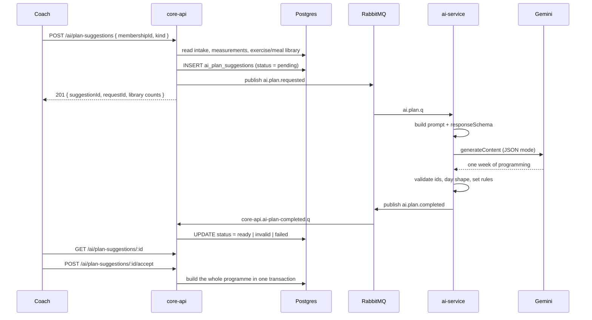

# How the AI works in CoachHub

A walkthrough of the AI service: what it does, how a request travels through the
system, and why the design is the way it is.

---

## 1. The AI does two different jobs

They share a service and a model, and almost nothing else.

| | **Ask a question** | **Design a programme** |
|---|---|---|
| Trigger | WebSocket message | `POST /ai/plan-suggestions` |
| Queue | `ai.q` | `ai.plan.q` |
| Grounded by | RAG — MongoDB Atlas vectors | The coach's library, read live from Postgres |
| Answer is | free text | schema-constrained JSON |
| Delivered by | WebSocket, back to the socket that asked | stored in `ai_plan_suggestions`, read over REST |
| Lives for | one message | days — until the coach accepts or declines |

They get **separate queues** on purpose. A chat question answers in seconds; a
full programme takes 30–60 seconds with a large prompt and a large response. On
one queue every plan would block every question behind it, and the two could not
be retried or dead-lettered apart.

---

## 2. The idea behind plan generation

The whole feature rests on one observation about the database:

```sql
planned_exercises.exercise_id    -- NOT NULL, FK → exercises,  ON DELETE RESTRICT
planned_meals.source_meal_id     -- NOT NULL, FK → meals,      ON DELETE RESTRICT
planned_meal_foods.source_food_id-- NOT NULL, FK → foods,      ON DELETE RESTRICT
```

**An exercise the model invents cannot be saved.** Postgres will refuse it.

So plan generation is not a *generation* problem, it is a **selection** problem.
The model is handed the coach's entire library and asked to pick ids from it. If
it goes off-script, that is caught and reported rather than discovered later as a
foreign-key violation.

This single fact drives most of what follows.

---

## 3. What happens when a coach asks for a plan



The request returns immediately. The plan arrives later, on its own.

---

## 4. What the model is actually told

Two things go out on `ai.plan.requested`:

### The client context

```json
{
  "client":  { "ageYears": 30, "gender": "male", "heightCm": 180, "weightKg": 79.4 },
  "intake":  { "goal": "fat_loss", "trainingExperience": "beginner",
               "availableEquipment": ["dumbbells"],
               "injuries": ["left shoulder impingement"],
               "medicalConditions": ["asthma"],
               "allergies": ["peanuts"] },
  "measurements": [ { "measuredAt": "2026-08-10", "weightKg": 79.4, "bodyFatPct": 22 } ],
  "history": {
    "checkins": [ { "date": "2026-08-10",
                    "clientNotes": "Shoulder still catching on anything overhead.",
                    "coachFeedback": "Keep pressing horizontal for now." } ],
    "sessions": [ { "date": "2026-08-12", "overallRpe": 9, "completed": false } ]
  },
  "constraints":  { "durationWeeks": 4, "daysPerWeek": 3, "goal": "fat_loss" },
  "library":      { "counts": { "exercises": 47 }, "truncated": false },
  "coachNotes": "Shoulder still recovering — keep overhead pressing light."
}
```

**No name, no email, no date of birth.** Designing a programme needs a body and a
history, not an identity. Age is derived and the birth date is dropped — the
cheapest way to keep a client's name out of a third-party prompt log is never to
put it there.

### The candidate library

Every exercise the client can actually train with:

```
id | name | category | primary muscle | secondary | equipment
b0000001-… | Goblet Squat | strength | quads | glutes | dumbbells
```

Filtering is **containment, not overlap** — the client must own *everything* an
exercise needs. A movement tagged `{barbell, machines}` is no use to someone with
a bench. Bodyweight exercises list no equipment and so always pass.

`full_gym` is a special case: read literally it matches only exercises tagged
`full_gym`, so it expands to every equipment type instead.

For nutrition the same idea applies to **allergens** — meals containing something
the client reacts to are removed before the model ever sees them. Dietary
preferences are *not* hard-filtered; they travel as constraints, because a
preference is a judgement call and an allergy is a safety fact.

---

## 5. The five decisions worth defending

### One week, not twelve

The schema asks for **a single week plus a progression rule**, never the whole
programme.

Generating all twelve weeks costs roughly eight times the output tokens,
routinely truncates at `maxOutputTokens`, and produces weeks that *drift* rather
than progress.

At acceptance the week repeats for the full duration and the rule travels on
every week's notes, where the coach applying it will see it:

```
week 1 | (baseline)
week 2 | Add one rep per set each week.
week 3 | Add one rep per set each week.
```

*It does not auto-inflate the numbers.* Progressive overload means more weight —
and the model is never asked for a weight (see below), so there is nothing to do
arithmetic on. Inflating reps instead reads fine in week 2 and is nonsense by
week 12.

### The model never prescribes a weight

Nothing in the context says what this client can lift, so a number in kilograms
would be invented — and invented load is the one field in a training plan that
can actually hurt someone.

Intensity is prescribed as **RPE** or **RIR** instead, which is exactly what a
coach writing for an unfamiliar client would do.

### The model never writes an exercise name

It returns `exerciseId` and nothing else. Name, category, muscles, media and
instructions are copied from the live `exercises` row at acceptance. Asking the
model to describe an exercise only invites it to describe it differently from
the library it came from.

### The plan reacts to what has actually happened

The intake says what the client wanted at signup. `history` says whether it has
been working — and a plan written three months later that ignores all of it is
just the first plan again.

Six check-ins and ten logged sessions travel with the request: the client's own
words, the coach's replies, session RPE, and whether sessions were finished.
Only rows carrying text or an RPE are collected — a pending check-in is a
scheduling artefact, not feedback.

It is read straight from Postgres, not through the knowledge base, for the same
reason the exercise library is. It must be *this client's* history and all of
it: vector retrieval is scoped by tenant, so a similarity search could surface
another client's check-in — and "the six most similar notes" is the wrong shape
for a question whose answer is "the six most recent".

A worked example. Three check-ins saying the shoulder catches on overhead press
and *"the 5-day split is too much"* produced:

> **3-Day Joint-Friendly Hypertrophy Split**
> *"…transitions the client to a manageable 3-day full-body split to resolve
> scheduling burnout. We have completely removed overhead pressing to protect
> the unstable shoulder…"*

Nothing in the intake said either of those things.

### RAG is used for questions, not for plans

The knowledge base answers *"how do I cue a hinge?"* — six semantically similar
chunks are exactly right for that.

Choosing exercises needs the **complete** set the coach is allowed to pick from,
which comes from Postgres in full, on the request itself. A newly added exercise
is therefore available to plan generation **immediately**; the 30-minute ingest
lag only affects what the chat assistant can talk about.

---

## 6. Constraining the output

Gemini is called in JSON mode with a `responseSchema` — an OpenAPI subset with
upper-case type names and a fixed `propertyOrdering`.

```
temperature       0.2      (near-deterministic; creativity here means invented fields)
maxOutputTokens   32768    (sized for a full week plus the model's own reasoning)
responseMimeType  application/json
responseSchema    { … }
```

Both fields matter. `responseMimeType` stops the model wrapping its answer in a
markdown fence; the **schema** is what stops it inventing field names.

Chat uses a second profile — `temperature 0.7`, `maxOutputTokens 2048` — because
prose and schema-constrained JSON want opposite settings.

---

## 7. Validation

`PlanValidator` checks only things core-api's schema would *reject on insert*:

| code | severity | mirrors |
|---|---|---|
| `unknown_exercise` / `unknown_meal` | error | the NOT NULL foreign key |
| `invalid_day_number`, `duplicate_day` | error | `day_number BETWEEN 1 AND 7`, unique per week |
| `duplicate_position` | error | unique `(parent, position)` |
| `ambiguous_set`, `empty_set` | error | `ck_planned_sets_single_prescription_mode` |
| `reps_max_without_min` | error | `ck_planned_sets_reps_max_requires_min` |
| `incomplete_intensity` | error | `(intensity_type IS NULL) = (intensity_value IS NULL)` |
| `empty_training_day`, `rest_day_has_exercises` | error | — |
| `days_per_week_mismatch` | **warning** | nothing — the coach simply asked for something else |

Two rules govern it:

- **It reports; it never repairs.** Silently dropping an invented exercise would
  produce a shorter plan that looks deliberate, and the coach would never learn
  the model went off-script.
- **It has no opinions about programme quality.** A validator that starts judging
  rep ranges is one that cries wolf.

`error` blocks acceptance. `warning` does not.

---

## 8. Who decides what

**ai-service reports facts. core-api owns the state.**

ai-service says: *a plan came back, and here is what is wrong with it.* Turning
that into a status happens in core-api, because core-api owns the table.

```
                      any error-severity warning?
ai.plan.completed ──┬── status: failed ─────────────► failed
                    ├── succeeded, warnings clean ──► ready
                    └── succeeded, has errors ──────► invalid   (plan is still kept)
```

`invalid` keeps the plan deliberately. The coach cannot accept it, but *"here is
what it proposed and here is what is wrong with it"* is a far more useful screen
than an empty one — and the only way to judge whether retrying is worth it.

### The lifecycle

```
pending ──► ready ────► accepted   (programme or nutrition plan built)
        │          └──► declined   (reason recorded)
        ├──► invalid ─► declined
        └──► failed
```

Three CHECK constraints keep that honest in the database:

- an `accepted` row has exactly one result id, and it matches the kind
- `ready` and `accepted` rows must have a plan
- `decided_at` is set for exactly `accepted` and `declined`

---

## 9. Accepting a plan

`POST /ai/plan-suggestions/:id/accept` builds the real thing, in **one
transaction**:

```
Program → weeks → days → planned_exercises → planned_sets
NutritionPlan → weeks → days → planned_meals → planned_meal_foods
```

Both halves commit or neither. A programme written without the suggestion
flipping to `accepted` would be a programme the coach could accept again.

Before building, **every id is re-checked against the live library** — a coach
may have archived an exercise while the suggestion sat waiting for days. If any
have gone:

```
409  "1 exercise in this plan no longer exists in the library.
      The suggestion has been marked invalid; generate a new one."
```

The suggestion is marked `invalid` *after* the rollback, on its own — otherwise
the coach gets a button that keeps failing with nothing on screen explaining why.

Only a `ready` suggestion can be accepted. `invalid` can still be **declined** —
a bad plan is still an answer, and the reason is the natural seed for a
regenerated request.

---

## 10. When things go wrong

| failure | what happens |
|---|---|
| Gemini returns 503 / 429 / 5xx | **retried** in `GeminiClient`, 3 attempts, exponential backoff |
| Gemini returns 403 / 404 / 400 | **not** retried — a bad key does not un-reject itself |
| Prompt blocked by safety | `failed`, with `blockReason` named |
| Output truncated at `maxOutputTokens` | `failed`, naming the limit, so it reads as a config problem |
| Output is not valid JSON | `failed` — never an exception out of the listener |
| Message delivered twice | second one is a no-op; idempotent on `requestId` |
| ai-service never answers | the row is written off after 10 minutes so the coach is not locked out |
| Malformed message | 3 listener retries, then `ai.plan.dlq` |

Two things are deliberately *not* done:

- **The listener never requeues a failed generation.** A redelivery would publish
  a second completion for the same suggestion. That is also why the retry lives
  in the HTTP client — if it does not happen there, it does not happen at all.
- **Gemini is never called twice for one request.** The Mongo `ai_requests`
  collection has a unique index on `requestId`; a redelivered event that already
  succeeded returns immediately. Generation is the most expensive call the
  service makes.

Every call also carries a connect and read timeout. The JDK default is to wait
forever, and a plan generation holds a queue consumer for its whole duration —
one hung connection would stop `ai.plan.q` permanently, silently.

---

## 11. RAG, for the chat assistant

```
core_db ──┐
          ├──► KnowledgeIngestService ──► embed ──► MongoDB Atlas Vector Search
kb/*.md ──┘        (every 30 min)
```

Six SELECTs feed it: exercises, programs, meals, foods, nutrition plans, client
intakes — plus curated markdown in `resources/kb`.

- **Content-hash ids.** A document whose text has not changed keeps the same id,
  so a re-run costs one cheap read and *zero* embedding calls.
- **Pruning.** Anything in the store this run did not produce is stale by
  definition and is removed — which is why writing to Atlas by hand does not
  survive.
- **A safety brake.** A sync wanting to delete more than half the collection is
  refused: that pattern means a fault far more often than a genuine turnover.
- **Tenant isolation.** `tenantId` is an Atlas filter field. The store holds every
  coach's own library and client profiles, and this is what keeps one coach's
  question away from another's data.

Retrieval is fail-soft — if it breaks, the assistant answers without context
rather than not at all.

---

## 12. The WebSocket contract

**This is the part to be precise about, because it differs by feature.**

### Chat — yes, WebSocket

The client connects, authenticates on the handshake, then sends:

```js
socket.emit('ai.requested', { kind: 'advice', prompt: '…', clientId: '…' });
```

and listens for:

| event | when | payload |
|---|---|---|
| `ai.accepted` | queued | `{ requestId }` |
| **`ai.completed`** | **the answer arrived** | `{ requestId, status, summary, … }` |
| `ai.timed_out` | no answer in time | `{ requestId }` |
| `ai.rejected` | malformed request; socket stays open | `{ message }` |
| `ai.unauthorized` | bad or missing token; socket closes | `{ message }` |

**Success and failure both arrive on `ai.completed`.** There is no separate
failure event — read `payload.status`:

```js
socket.on('ai.completed', ({ requestId, status, summary }) => {
  if (status === 'succeeded') { /* show summary */ }
  else                        { /* show the error */ }
});
```

The socket is re-authenticated on every message, not just at connect: a
connection can stay open for hours while an access token expires in minutes.

### Plan generation — no WebSocket

> There is currently **no** WebSocket event for plan generation.
> `ai.plan.completed` is a RabbitMQ message between services; it never reaches
> the browser.

The frontend must **poll**:

```
GET /ai/plan-suggestions/:id      →  status: pending | ready | invalid | failed
```

Poll every few seconds until `status !== 'pending'`. Typical generation takes
20–60 seconds.

The reason is structural rather than an oversight: the gateway's rooms are keyed
by `requestId` and joined by the socket that sent the request. A plan is started
over HTTP, so no socket is in that room. Pushing plan results would need a
coach-scoped room and a subscribe message — a small piece of work, not yet done.

`POST /ai/plan-suggestions` returns the `requestId` and `suggestionId`, so
everything needed to add it later is already on the wire.

---

## 13. Configuration worth knowing

| setting | default | note |
|---|---|---|
| `GEMINI_MODEL` | `gemini-2.5-flash` | 404s for newer Google accounts — set a 3.x model |
| `gemini.json.temperature` | `0.2` | plans |
| `gemini.json.max-output-tokens` | `32768` | raise if plans truncate |
| `gemini.chat.temperature` | `0.7` | prose |
| `gemini.retry.max-attempts` | `3` | × read-timeout must stay under core-api's 10-minute window |
| `gemini.read-timeout` | `3m` | a week of programming legitimately takes a minute |
| history window | 6 check-ins, 10 sessions | `PlanContextService` constants |
| `coachhub.rag.top-k` | `6` | chunks per question |
| `coachhub.rag.similarity-threshold` | `0.62` | Atlas normalises cosine to `[0,1]`; 0.5 is unrelated |
| `coachhub.rag.ingest.interval` | `30m` | |

---

## 14. Honest limitations

- **Plan quality is unmeasured.** Validation proves a plan can be *saved*, not
  that it is *good*. Nothing checks weekly volume or muscle balance — that is the
  coach's review, by design.
- **Allergy matching is text against tags.** Clients type prose ("Alergic to
  lactose"); foods carry single-word tags (`milk`). Matching is whole-word and
  fails safe, and seed foods carry synonyms, but the durable fix is a controlled
  allergen list at intake.
- **An empty library produces an empty plan.** With no exercises or meals seeded,
  the model can only return sensible targets and nothing to do. Seed the library
  first — this is a data problem that reads as a model problem.
- **No DLQ consumer or alerting** on `ai.dlq` / `ai.plan.dlq`.
