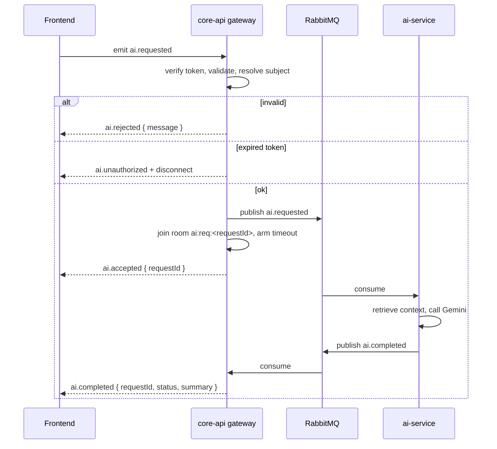

# Integrating the AI chat — a frontend guide

Everything the web or mobile client needs to talk to CoachHub's AI assistant:
the socket to open, the token to open it with, the four events to listen for,
and the handful of edge cases that will otherwise show up as "it works on my
machine and hangs in the demo".

> Companions: [`ai-service.md`](./ai-service.md) explains why the assistant is
> built this way, [`ai-module-code.md`](./ai-module-code.md) maps the classes,
> and [`rag-and-plan-suggestions.md`](./rag-and-plan-suggestions.md) follows the
> data. This one is the wire contract, and nothing else.

---

## 1. In one minute

```bash
npm install socket.io-client   # v4 — the server is socket.io v4 via @nestjs/platform-socket.io
```

```ts
import { io } from 'socket.io-client';

const socket = io('http://localhost:3000', {
  auth: { token: accessToken },      // the access token from POST /auth/login
  transports: ['websocket'],
});

socket.on('ai.accepted',  ({ requestId }) => console.log('queued', requestId));
socket.on('ai.completed', ({ requestId, status, summary }) => console.log(status, summary));
socket.on('ai.rejected',  ({ message }) => console.error('bad request:', message));
socket.on('ai.timed_out', ({ requestId }) => console.warn('no answer yet', requestId));
socket.on('ai.unauthorized', () => console.error('token rejected — socket is closing'));

socket.emit('ai.requested', { kind: 'advice', prompt: 'How do I progress a beginner squat?' });
```

That is the whole protocol. The rest of this document is the detail that makes
it survive contact with a real session.

---

## 2. Which socket is which

CoachHub has **two** gateways, and they are unrelated:

| Purpose | Namespace | Where |
| --- | --- | --- |
| **AI assistant** (this document) | `/` — the default namespace | `src/ai/ai.gateway.ts` |
| Coach ⇄ client human chat | `/chat` | `src/chat/chat.gateway.ts` |

So `io(BASE_URL)` reaches the AI, and `io(BASE_URL + '/chat')` reaches the
messaging feature. They use different event names and different rooms; nothing
crosses over. If you wire the AI events onto the `/chat` socket, nothing errors
— you simply never get a reply.

The socket.io path is the default `/socket.io`; core-api sets no global route
prefix, so the base URL is just the API origin.

---

## 3. Connecting

### 3.1 Getting a token

Both kinds of account can use the assistant, and both log in the same way:

| Who | Endpoint | Response |
| --- | --- | --- |
| Coach | `POST /auth/login` | `{ user, accessToken, refreshToken }` |
| Client | `POST /auth/customer/login` | `{ client, accessToken, refreshToken }` |

Pass the **`accessToken`** — the refresh token is signed with a different secret
and is rejected outright.

### 3.2 Where the token goes

```ts
const socket = io(BASE_URL, {
  auth: { token: accessToken },   // ← this, always
  transports: ['websocket'],
});
```

`auth.token` is the socket.io handshake convention and the only mechanism a
browser has, because the WebSocket API cannot set request headers.

An `Authorization: Bearer …` header also works, for non-browser callers such as
tests and CLI tools.

**A query string does not work, deliberately.** Tokens in query strings end up
in access logs and proxy traces, so `WsAuthService.extractToken` never looks
there. If you have a client passing `?token=…`, it will be treated as having no
token at all.

### 3.3 CORS

The gateway's allowed origins come from `ALLOWED_ORIGINS` (comma-separated),
falling back to `FRONTEND_URL`, falling back to `http://localhost:5173`. If your
dev server runs anywhere else — port 3001, a LAN IP for phone testing, a preview
deployment — add it there or the handshake fails before any of your event
handlers matter.

A handshake that fails this way surfaces as `connect_error`, not
`ai.unauthorized`:

```ts
socket.on('connect_error', (err) => console.error('handshake failed:', err.message));
```

### 3.4 A client with no coach cannot connect

A client token carries `tenantId: null` until they belong to a tenant. The AI
socket rejects it — the tenant is what scopes every knowledge-base lookup, so a
session without one has nothing it could safely retrieve.

Practically: **hide or disable the assistant for a client who has not joined a
coach yet.** If you show it anyway, they get an instant `ai.unauthorized` and a
closed socket, which looks like a bug.

---

## 4. The event contract

Five events, all of them namespaced `ai.*`, plus one generic fallback.

### Client → server

| Event | Payload | Notes |
| --- | --- | --- |
| `ai.requested` | `{ kind, prompt, clientId?, membershipId? }` | The only message the AI gateway accepts. |

### Server → client

| Event | Payload | When |
| --- | --- | --- |
| `ai.accepted` | `{ requestId: string }` | The question passed validation and was queued. **This is where the `requestId` comes from.** |
| `ai.completed` | `{ requestId, clientId, coachId, coachEmail, status, summary }` | The answer, or a recorded failure. `status` is `'succeeded' \| 'failed'`. |
| `ai.timed_out` | `{ requestId: string }` | No answer within `AI_REQUEST_TIMEOUT_MS`. **Not final** — see §8.3. |
| `ai.rejected` | `{ message: string }` | The request was malformed. The socket stays open. |
| `ai.unauthorized` | `{ message: 'Unauthorized' }` | No valid token. The socket is closed immediately after. |
| `exception` | `{ statusCode, message, timestamp }` | Something threw server-side — e.g. the broker is unreachable. Rare, but it is a real event and it carries no `requestId`. |

TypeScript definitions:

```ts
export interface AiRequested {
  kind: string;
  prompt: string;
  clientId?: string | null;
  membershipId?: string | null;
}

export interface AiAccepted { requestId: string }

export interface AiCompleted {
  requestId: string;
  clientId: string | null;
  coachId: string | null;
  coachEmail: string | null;
  status: 'succeeded' | 'failed';
  summary: string;
}

export interface AiTimedOut     { requestId: string }
export interface AiRejected     { message: string }
export interface AiUnauthorized { message: string }
export interface WsException    { statusCode: number; message: string; timestamp: string }
```

---

## 5. The request payload

```ts
socket.emit('ai.requested', {
  kind: 'advice',
  prompt: 'What should I change for a client with shoulder impingement?',
  membershipId: '…',   // coach only, optional
  clientId: '…',       // optional metadata
});
```

### `prompt` — required

Trimmed server-side. Empty after trimming → `ai.rejected`. Longer than **4000
characters** → `ai.rejected`.

Enforce both in the UI. A disabled send button and a character counter cost
nothing and turn a round trip into an instant, local response.

### `kind` — required

Any non-empty string. It is not an enum: it is passed straight through and
appears in the prompt as a label — `=== Request (kind: advice) ===` — which
nudges the model's register without constraining it.

Pick a small vocabulary and stick to it so the answers stay consistent.
`advice` is what the CLI tester uses and is a sensible default.

> Do not confuse this with `PlanSuggestionKind` (`training` / `nutrition`),
> which belongs to the plan-suggestion REST API and *is* a strict enum.

### `membershipId` — optional, coach only

**This is the field that decides what the answer knows.**

- **Set it**, and retrieval may draw on that one client's private material —
  their intake (goals, injuries, medical conditions, allergies) and their
  check-ins.
- **Omit it**, and the answer is grounded only in material that belongs to no
  particular client: the coach's exercise library, meals and foods, and the
  curated coaching corpus.

It must be a UUID, and it must be a membership in the caller's own tenant —
verified against the database on every message, never trusted from the payload.
A membership from another tenant is `ai.rejected` with
`"client not found in this tenant"`.

Get the value from `GET /memberships`, which returns the coach's roster with the
`membershipId` every other coach-facing endpoint is keyed on.

**A client's socket may send this field and it is ignored.** Not validated and
rejected — ignored. A client is always scoped to themselves, resolved from their
own token. Do not build UI around it on the client side.

### `clientId` — optional, metadata only

Must be a UUID if present. It is echoed back on `ai.completed` and is convenient
for attribution in your own state, but it grants no access to anything. For a
client's own socket it defaults to their own id.

If you want the answer to *know about* a client, that is `membershipId`, not
this.

---

## 6. Who may ask about whom

The rule, in three rows:

| Asker | `membershipId` sent | What the answer can see |
| --- | --- | --- |
| Coach | none | Their own library + the curated corpus |
| Coach | a membership in their tenant | The above, plus that one client's intake and check-ins |
| Client | anything, or nothing | The corpus, plus their own material — always, only, themselves |

This is checked in `AiSubjectService`, against Postgres, on every single
message. It is the one security decision in the chat path.

The consequence worth knowing as a frontend developer: **a coach cannot ask a
roster-wide question.** *"Which of my clients has a shoulder problem?"* returns
nothing useful, because retrieval is scoped to at most one client at a time.
Questions like that belong to a REST endpoint over the database, not the
assistant.

---

## 7. The lifecycle of one request



Two things follow from this shape:

1. **The answer is asynchronous and out-of-band.** There is no acknowledgement
   callback carrying the result; `ai.accepted` and `ai.completed` are separate
   deliveries, typically seconds apart.
2. **The reply is addressed to a room the asking socket joined.** If that socket
   goes away, the answer has nowhere to land. See §9.

---

## 8. Every event in detail

### 8.1 `ai.accepted`

```ts
socket.on('ai.accepted', ({ requestId }: AiAccepted) => { … });
```

The question was accepted and published. `requestId` is a UUID minted by the
server and is the **only** way to correlate the eventual answer.

Store it before the answer arrives. If you drop it, the matching `ai.completed`
becomes unattributable.

### 8.2 `ai.completed`

```ts
socket.on('ai.completed', (event: AiCompleted) => {
  if (event.status === 'succeeded') render(event.summary);
  else showFriendlyError();
});
```

`status: 'succeeded'` → `summary` is the assistant's answer, as Markdown-flavoured
prose from Gemini. Render it through your Markdown renderer, and sanitize before
inserting HTML.

`status: 'failed'` → **`summary` is not an answer.** It is the literal string
`"AI request failed: <exception message>"` — an internal diagnostic, which on a
quota-exhausted day reads like `AI request failed: 429 RESOURCE_EXHAUSTED …`.

> Never render a failed `summary` to a user. Log it, show your own copy. This is
> the single most likely way for backend internals to leak into a demo.

### 8.3 `ai.timed_out`

```ts
socket.on('ai.timed_out', ({ requestId }: AiTimedOut) => { … });
```

Emitted when no `ai.completed` arrived within `AI_REQUEST_TIMEOUT_MS` — **120 s**
in the full-stack `docker-compose.yml`, **30 s** in the core-api-only compose
files and the code default. Check which one your environment runs before you
tune any client-side timer.

**It does not cancel anything.** ai-service is still working, and if the answer
arrives at 130 s it *is* still delivered to that socket, after the timeout event.
So treat this as "taking longer than expected", not as a closed door: leave the
handler for `ai.completed` in place, and be able to accept a late answer for a
request you have already given up on — or explicitly discard it, but decide
deliberately rather than by accident.

### 8.4 `ai.rejected`

```ts
socket.on('ai.rejected', ({ message }: AiRejected) => { … });
```

Client error. The socket stays open and usable. The messages you can get:

| `message` | Cause |
| --- | --- |
| `prompt is required` | Missing, not a string, or empty after trim |
| `prompt must be at most 4000 characters` | Too long |
| `kind is required` | Missing, not a string, or empty after trim |
| `clientId must be a UUID` | Present but malformed |
| `membershipId must be a UUID` | Present but malformed |
| `client not found in this tenant` | Well-formed UUID, but not a membership the caller owns |

**`ai.rejected` carries no `requestId`** — the request never got one. See §8.7
for what that means for correlation.

### 8.5 `ai.unauthorized`

```ts
socket.on('ai.unauthorized', () => { /* refresh + reconnect */ });
```

Two occasions:

- **At handshake**, when the token is missing, invalid, expired, of the wrong
  type, or missing its tenant.
- **On any message**, because the gateway re-verifies the token on *every*
  `ai.requested` rather than trusting the one presented at connect time.

Either way the socket is disconnected immediately afterwards. This is §9's
problem, and it is the one that most often looks like a mysterious dead chat.

### 8.6 `exception`

```ts
socket.on('exception', ({ message }: WsException) => { … });
```

An unhandled server-side error inside the message handler — most plausibly the
broker being unreachable when the request is published. It carries no
`requestId`, so the same correlation caveat applies. Handle it as "something
broke, the ask did not go through", and re-enable your input.

### 8.7 Correlating requests and answers

`ai.completed` and `ai.timed_out` carry a `requestId` and correlate cleanly.
`ai.accepted` is where that id is born. `ai.rejected` and `exception` carry
nothing.

The handler is asynchronous and socket.io does not wait for one message to
finish before starting the next, so with several rapid sends you cannot reliably
say which one a bare `ai.rejected` refers to.

**Keep at most one un-acknowledged ask in flight.** Send, disable input, wait for
`ai.accepted` (or a rejection), then re-enable. This is what a chat UI wants
anyway, and it makes correlation exact rather than probable.

Once you hold the `requestId`, any number of answers can be outstanding
concurrently without ambiguity.

---

## 9. Token expiry, and why your chat dies after fifteen minutes

Access tokens default to **7 days** (`JWT_ACCESS_EXPIRES_IN`). The gateway
re-verifies on every message. So the failure mode is precise and easy to
reproduce: open the assistant, leave the tab for twenty minutes, ask a question
— `ai.unauthorized`, socket closed, nothing on screen but a spinner.

Handle it explicitly:

```ts
socket.on('ai.unauthorized', async () => {
  const fresh = await refreshAccessToken();      // POST /auth/refresh
  socket.auth = { token: fresh };                // socket.io re-reads this on connect
  socket.connect();
});
```

Better still, do not wait to be told:

- Refresh proactively on a timer comfortably shorter than the token's lifetime.
- Update `socket.auth` whenever your auth store issues a new token.
- Reconnect on `visibilitychange` when a tab comes back after a long sleep.

An expired token also means **the in-flight request is gone** — the rejection
happens before dispatch, so nothing was ever queued. Re-send the prompt after
reconnecting.

---

## 10. Reconnection loses in-flight answers

The reply is emitted to the room `ai:req:<requestId>`, and only the socket that
asked is in that room. Socket.io rooms do not survive a reconnect — a new
connection is a new socket id and a new, empty set of rooms.

So: **if the socket drops between `ai.accepted` and `ai.completed`, that answer
is lost permanently.** It is not queued, not replayed, and there is no endpoint
to fetch it from — the free-text chat path deliberately stores nothing on the
core-api side.

What to do about it:

```ts
socket.on('disconnect', () => {
  // Everything still waiting will never be answered on the new connection.
  pending.forEach((p) => p.fail('Connection lost — please ask again.'));
  pending.clear();
});
```

Say so in the UI rather than leaving spinners running. And keep the user's
prompt text around so "ask again" is one click, not one retype.

> If you need answers that survive a refresh, that is the plan-suggestion path,
> not this one: suggestions are rows in `ai_plan_suggestions`, fetched over REST,
> and they are still there tomorrow.

---

## 11. Rate limiting

There is **none** on the socket path. The HTTP auth routes are throttled;
`ai.requested` is not.

Every accepted request costs a Gemini call, and the development key is on a free
tier with a low daily ceiling. A held-down send button or a retry loop can
exhaust the whole day's quota in under a minute, after which every request comes
back `status: 'failed'`.

Debounce client-side. The "one un-acknowledged ask at a time" rule from §8.7
covers most of it on its own.

---

## 12. A complete client

Framework-agnostic, promise-per-request, and it handles every case above.

```ts
import { io, Socket } from 'socket.io-client';

export interface AskOptions {
  kind?: string;
  membershipId?: string | null;
  clientId?: string | null;
  /** Give up locally after this long. Keep it above the server's timeout. */
  timeoutMs?: number;
}

export interface AskResult {
  requestId: string;
  summary: string;
}

const MAX_PROMPT_LENGTH = 4000;

export class AiChatClient {
  private socket: Socket;
  private pending = new Map<
    string,
    { resolve: (r: AskResult) => void; reject: (e: Error) => void; timer: ReturnType<typeof setTimeout> }
  >();
  /** The ask that has been emitted but not yet acknowledged. */
  private inFlight: { resolve: (id: string) => void; reject: (e: Error) => void } | null = null;

  constructor(
    baseUrl: string,
    private getToken: () => string,
    private onUnauthorized: () => Promise<string>,
  ) {
    this.socket = io(baseUrl, {
      auth: { token: getToken() },
      transports: ['websocket'],
      autoConnect: true,
    });

    this.socket.on('ai.accepted', ({ requestId }: { requestId: string }) => {
      this.inFlight?.resolve(requestId);
      this.inFlight = null;
    });

    this.socket.on('ai.completed', (event: {
      requestId: string;
      status: 'succeeded' | 'failed';
      summary: string;
    }) => {
      const entry = this.pending.get(event.requestId);
      if (!entry) return;                       // late answer after a local give-up
      clearTimeout(entry.timer);
      this.pending.delete(event.requestId);

      if (event.status === 'succeeded') {
        entry.resolve({ requestId: event.requestId, summary: event.summary });
      } else {
        // event.summary is an internal diagnostic. Log it, never show it.
        console.error('ai failed:', event.summary);
        entry.reject(new Error('The assistant could not answer. Please try again.'));
      }
    });

    this.socket.on('ai.timed_out', ({ requestId }: { requestId: string }) => {
      // Advisory: the answer may still arrive. Surface it, keep the entry alive
      // until the local timer decides.
      console.warn('ai request slow:', requestId);
    });

    this.socket.on('ai.rejected', ({ message }: { message: string }) => {
      this.failInFlight(new Error(message));
    });

    this.socket.on('exception', ({ message }: { message: string }) => {
      this.failInFlight(new Error(message ?? 'Server error'));
    });

    this.socket.on('ai.unauthorized', async () => {
      this.failEverything(new Error('Session expired.'));
      const fresh = await this.onUnauthorized();
      this.socket.auth = { token: fresh };
      this.socket.connect();
    });

    this.socket.on('disconnect', () => {
      // Rooms do not survive a reconnect, so nothing outstanding can be answered.
      this.failEverything(new Error('Connection lost — please ask again.'));
    });

    this.socket.on('connect_error', (error) => {
      this.failEverything(new Error(`Cannot reach the assistant: ${error.message}`));
    });
  }

  async ask(prompt: string, options: AskOptions = {}): Promise<AskResult> {
    const text = prompt.trim();
    if (!text) throw new Error('Type a question first.');
    if (text.length > MAX_PROMPT_LENGTH) {
      throw new Error(`Questions are limited to ${MAX_PROMPT_LENGTH} characters.`);
    }
    if (this.inFlight) throw new Error('Still sending the previous question.');

    const requestId = await new Promise<string>((resolve, reject) => {
      this.inFlight = { resolve, reject };
      this.socket.emit('ai.requested', {
        kind: options.kind ?? 'advice',
        prompt: text,
        ...(options.membershipId ? { membershipId: options.membershipId } : {}),
        ...(options.clientId ? { clientId: options.clientId } : {}),
      });
    });

    return new Promise<AskResult>((resolve, reject) => {
      const timer = setTimeout(() => {
        this.pending.delete(requestId);
        reject(new Error('The assistant is taking too long. Please try again.'));
      }, options.timeoutMs ?? 180_000);          // longer than the server's 120s
      this.pending.set(requestId, { resolve, reject, timer });
    });
  }

  disconnect() {
    this.failEverything(new Error('Disconnected.'));
    this.socket.disconnect();
  }

  private failInFlight(error: Error) {
    this.inFlight?.reject(error);
    this.inFlight = null;
  }

  private failEverything(error: Error) {
    this.failInFlight(error);
    this.pending.forEach((entry) => {
      clearTimeout(entry.timer);
      entry.reject(error);
    });
    this.pending.clear();
  }
}
```

Usage:

```ts
const ai = new AiChatClient(import.meta.env.VITE_API_URL, () => auth.accessToken, () => auth.refresh());

try {
  const { summary } = await ai.ask('How should I progress this client?', {
    membershipId: selectedMembershipId,
  });
  appendMessage({ role: 'assistant', text: summary });
} catch (error) {
  appendMessage({ role: 'system', text: (error as Error).message });
}
```

---

## 13. A React hook

```tsx
import { useCallback, useEffect, useRef, useState } from 'react';
import { AiChatClient } from './ai-chat-client';

export interface Message {
  id: string;
  role: 'user' | 'assistant' | 'system';
  text: string;
}

export function useAiChat(membershipId?: string | null) {
  const clientRef = useRef<AiChatClient | null>(null);
  const [messages, setMessages] = useState<Message[]>([]);
  const [busy, setBusy] = useState(false);

  useEffect(() => {
    const client = new AiChatClient(
      import.meta.env.VITE_API_URL,
      () => auth.accessToken,
      () => auth.refresh(),
    );
    clientRef.current = client;
    // Tear the socket down with the component, or a route change leaves it open
    // and the next mount opens a second one.
    return () => client.disconnect();
  }, []);

  const send = useCallback(
    async (text: string) => {
      if (busy || !clientRef.current) return;
      setBusy(true);
      setMessages((m) => [...m, { id: crypto.randomUUID(), role: 'user', text }]);

      try {
        const { requestId, summary } = await clientRef.current.ask(text, { membershipId });
        setMessages((m) => [...m, { id: requestId, role: 'assistant', text: summary }]);
      } catch (error) {
        setMessages((m) => [
          ...m,
          { id: crypto.randomUUID(), role: 'system', text: (error as Error).message },
        ]);
      } finally {
        setBusy(false);
      }
    },
    [busy, membershipId],
  );

  return { messages, send, busy };
}
```

`busy` is doing real work here: it is the "one un-acknowledged ask at a time"
rule from §8.7, and it is also what disables the send button while the assistant
is thinking.

---

## 14. Error-handling matrix

Everything that can go wrong, what the user should see, and what you should do.

| Situation | You receive | Show the user | Do |
| --- | --- | --- | --- |
| Empty or over-long prompt | `ai.rejected` | The validation message | Catch it in the UI first |
| Malformed UUID | `ai.rejected` | Nothing — it is your bug | Fix the caller |
| Membership from another tenant | `ai.rejected` | "Client not found" | Re-fetch the roster |
| Token expired mid-session | `ai.unauthorized` + disconnect | "Reconnecting…" | Refresh, set `socket.auth`, reconnect, re-send |
| Client has no coach yet | `ai.unauthorized` at handshake | Hide the assistant entirely | Gate the feature on membership |
| Wrong origin / server down | `connect_error` | "Assistant unavailable" | Check `ALLOWED_ORIGINS`, then the service |
| Broker unreachable | `exception` | "Something went wrong" | Log `message`, re-enable input |
| Model failed or quota spent | `ai.completed` with `status: 'failed'` | Your own copy — **never `summary`** | Log `summary`, offer retry |
| Slow answer | `ai.timed_out` | "Still thinking…" | Keep listening; it may still land |
| Socket dropped while waiting | `disconnect` | "Connection lost — ask again" | Fail all pending, keep the prompt text |

---

## 15. Testing against a real backend

There is a terminal client in the repo that speaks exactly this protocol, and it
is the fastest way to check whether a problem is yours or the backend's:

```bash
cd services/core-api

# Interactive session as a coach
npm run ai:chat -- --email jane@acme.com --password password123

# One question, scoped to a client
npm run ai:chat -- --email jane@acme.com --password password123 \
  --membership <membershipId> --prompt "What should I watch for with this client?"

# See every raw event on the wire — this is the reference for what your
# handlers should be receiving
npm run ai:chat -- --email jane@acme.com --password password123 --verbose \
  --prompt "hello"

# List the memberships you can scope to
npm run ai:chat -- --email jane@acme.com --password password123 --clients
```

`--verbose` prints each event and its payload as it arrives. If the CLI gets an
answer and your app does not, the difference is in your client, not the server.

See [`local-testing.md`](./local-testing.md) for bringing the stack up.

---

## 16. Checklist before you call it done

- [ ] `socket.io-client` v4, connected to the **default** namespace, not `/chat`
- [ ] Token passed as `auth.token`, never a query string
- [ ] Your dev origin is in `ALLOWED_ORIGINS`
- [ ] Prompt validated client-side: non-empty, ≤ 4000 characters
- [ ] `kind` always sent, from a small fixed vocabulary
- [ ] `membershipId` sent for coaches when the question is about a client, taken from `GET /memberships`
- [ ] The assistant is hidden for clients with no coach
- [ ] One un-acknowledged ask at a time; send disabled while `busy`
- [ ] `requestId` from `ai.accepted` stored and used to match `ai.completed`
- [ ] A failed `summary` is logged, never rendered
- [ ] Markdown output sanitized before it becomes HTML
- [ ] `ai.unauthorized` refreshes the token and reconnects
- [ ] `disconnect` fails everything pending with a message the user can act on
- [ ] Local timeout longer than the server's (180 s against a 120 s backend)
- [ ] The socket is closed when the component unmounts

---

## 17. Mistakes that are easy to make

**Listening on the wrong namespace.** `/chat` is the human messaging gateway.
Silent failure, no error.

**Expecting an acknowledgement callback.** `socket.emit('ai.requested', body, cb)`
never calls `cb`. The reply is a separate event.

**Assuming `ai.rejected` carries a `requestId`.** It cannot — the request never
got one.

**Treating `ai.timed_out` as final.** The work continues, and the answer may
still arrive.

**Rendering a failed `summary`.** It is an exception message, and it will be the
thing on screen during the demo.

**Reconnecting and expecting the pending answer.** Rooms do not survive. It is
gone.

**Opening a socket per message.** One socket per session. Each new connection is
a fresh handshake and a fresh set of rooms.

**Forgetting the token expires.** Fifteen minutes, re-checked on every message.
It is the most common cause of "the assistant just stopped working".
