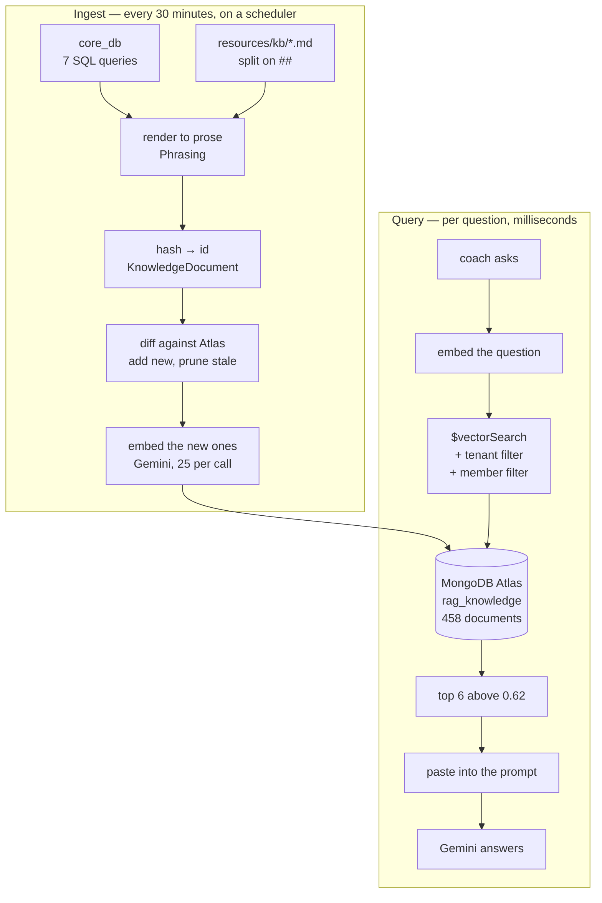
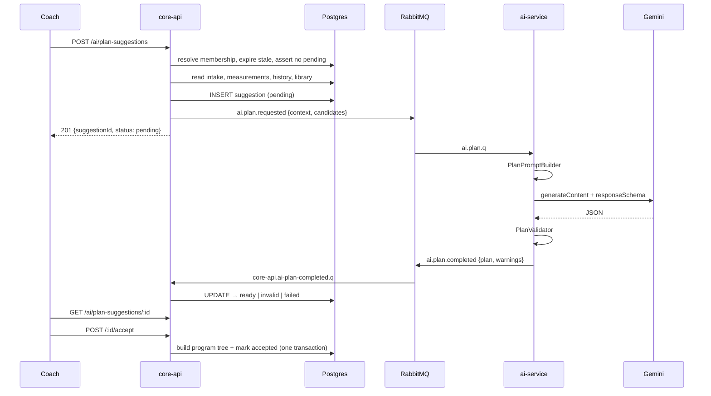
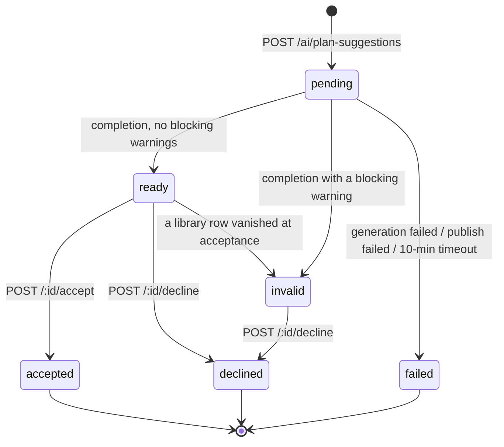

# RAG and plan suggestions, in detail

How the two hard parts of CoachHub's AI actually work — the knowledge base that
grounds the assistant's answers, and the pipeline that turns a coach's request
into a real training program.

They look similar from outside. Both take a client, ask a language model
something, and give a coach something back. Internally they share almost nothing,
and the reason why is the most important thing in this document.

> Companions: [`ai-service.md`](./ai-service.md) is the conceptual tour;
> [`ai-module-code.md`](./ai-module-code.md) is the class-by-class map. This one
> follows the data.

---

# Part I — RAG

## 1. What it is for, and what it is not for

RAG — retrieval-augmented generation — means: before asking the model a question,
go and find the material that might answer it, and paste that into the prompt.

The model is not fine-tuned, and nothing is remembered between calls. Everything
it appears to "know" about your gym arrived in the prompt milliseconds earlier.

**What it is for:** the coach's open-ended questions. *"How fast should a beginner
add weight?"* *"What has Alice been struggling with?"* *"What can I give someone
with a shoulder impingement?"* These have no fixed shape, could be answered by
anything in the corpus, and are perfectly served by "here are the six most
relevant paragraphs."

**What it is deliberately not for:** picking exercises for a plan. That is
Part II, and §22 explains why the distinction is not a matter of taste.

## 2. The loop



The two halves are completely independent. Ingest can be broken for a day and
questions still get answered — from vectors already stored. That is deliberate;
see §11.

## 3. Where the chunks come from

Two readers, 458 chunks in the dev corpus.

### `CoreDbKnowledgeReader` — 409 chunks

Seven read-only SQL queries against core-api's own Postgres, through
`analytics_user`, which already holds `SELECT` on everything.

| Source tag | Table | Scope |
|---|---|---|
| `exercise-library` | `exercises` | tenant |
| `program-template` | `programs` | tenant |
| `meal-library` | `meals` | tenant |
| `food-library` | `foods` | tenant |
| `nutrition-plan` | `nutrition_plans` | tenant |
| `client-profile` | `client_intakes` | **member** |
| `client-checkin` | `checkins` | **member** |

Each source is read independently and a failure in one is logged and skipped:
an unreadable meals table should cost the assistant its meal knowledge, not its
exercise library.

Why reach into another service's database at all? Because there is no synchronous
path between the two services, and the alternative — publishing an event for every
exercise a coach ever edits — is a lot of machinery to keep a *derived cache* in
step. The knowledge base is exactly that, and it is allowed to be half an hour
behind.

### `CuratedKnowledgeReader` — 49 chunks

Markdown shipped with the service, in `src/main/resources/kb/`:

| File | Sections |
|---|---|
| `coaching-practice.md` | adherence, re-engaging a quiet client, when to change a programme |
| `programming.md` | splits, weekly volume, deloads, block periodisation, warm-ups |
| `progressive-overload.md` | how fast to add weight, double progression, stalls, RIR |
| `training-goals.md` | hypertrophy, strength, fat loss, endurance, estimating 1RM |
| `nutrition.md` | protein, calories, macro splits, timing, hydration, fibre |
| `exercise-technique.md` | movement patterns, squat/hinge/press/pull cues, tempo, bracing |
| `recovery-and-safety.md` | sleep, soreness, overtraining, training around injury |

core_db cannot be the whole knowledge base. It knows what a barbell row is and
what Sara's injuries are, but nothing in it answers *"how fast should I add
weight"* — that is domain knowledge, not tenant data. It is tagged
`__global__` so every tenant retrieves it, which also means a fresh environment
with an empty database still has a working assistant.

**Chunking is by `##` heading, not by token count:**

> A token splitter would cut "protein is 1.6 to" / "2.2 g per kg" across two
> chunks and make both unusable. The files are written so that each `##` section
> is one self-contained idea, which is the unit a coach actually asks about, so
> the document structure is the chunking strategy.

## 4. Rendering — the stage that decides whether retrieval works at all

This is the part that looks cosmetic and is not. A row becomes a chunk by being
*written out as sentences*.

Consider a real intake row:

```
client                 | Sara Malik
goal                   | fat_loss
training_experience    | beginner
training_days_per_week | 3
focus_areas            | {strength,weight_loss}
available_equipment    | {dumbbells,resistance_bands}
allergies              | {peanuts}
medical_conditions     | {asthma}
injuries               | {"left shoulder impingement"}
```

`renderIntake` turns that into:

```
Client profile: Sara Malik.
Goal: fat loss.
Training experience: beginner.
Can train 3 days per week.
Focus areas: strength, weight loss.
Equipment available: dumbbells, resistance bands.
Allergies: peanuts.
Medical conditions to work around: asthma.
Injuries to work around: left shoulder impingement.
```

The `Phrasing` class states the stakes:

> Embeddings are computed over the text as written, so a chunk that reads
> `primary_muscle=LATS, equipment={PULL_UP_BAR}` sits nowhere near a coach asking
> *"what can my client do for their back at home"* — while *"Primarily works the
> lats. Equipment needed: pull up bar."* sits close to it. Rendering is not
> cosmetic here; it is the difference between a chunk being retrievable and being
> dead weight in the index.

Three details worth noticing:

- **`activity_level` was empty, so its line is absent entirely.** `appendIfPresent`
  omits blanks rather than writing "Activity level: null" — a phrase that would
  pull the chunk toward every other chunk containing the word null.
- **Injuries are phrased as "to work around"**, not "Injuries:". Phrased as a
  constraint so it lands near questions about what a client should avoid.
- **Free text is never case-folded.** Enums are humanised (`FAT_LOSS` → `fat
  loss`); allergies and injuries are the client's own words and are copied
  verbatim.

Bodyweight exercises say `Equipment needed: none (bodyweight).` rather than
omitting the line, because *"bodyweight" is something coaches search for, and an
absent field cannot be matched.*

## 5. Identity — the content hash

Every chunk's id is:

```
SHA-256( tenantId ∥ 0x00 ∥ membershipId ∥ 0x00 ∥ source ∥ 0x00 ∥ text )
```

This single decision is what makes the ingest re-runnable. Spring AI's default
`RandomIdGenerator` hands out a fresh UUID on every boot, so re-adding the same
material produces duplicates rather than updates — the reason an earlier seeder
could only ever run once, against an empty collection, and why editing a seeded
document had no effect.

With a content hash:

| Situation | Consequence |
|---|---|
| Row unchanged | Same id → already present → skipped, no embedding call |
| Row edited | New id → added; old id now generated by nothing → pruned |
| Row deleted | Its id is generated by nothing → pruned |

**Why tenant is in the hash.** Exercise libraries are copied per tenant from the
same defaults, so the same text genuinely exists under many tenants. Hashing text
alone would collapse them into one document and leak it across every coach.

**Why membership is in the hash.** Two clients of the same coach can write the
same sentence in a check-in. Collapsing those would show one client's words under
the other's name.

### The hazard

> Changing what goes into the hash **re-ids the entire corpus**. Every existing
> document becomes unreachable, every new one is an addition, and the prune brake
> will correctly refuse to clean up the old ones because it looks like the
> collection turning over. Adding an input is a one-off "empty the collection and
> re-ingest", not a deploy.

This has bitten twice, with opposite outcomes:

- Adding `membershipId` to the hash re-ided **all 455** documents. The brake
  refused, and they had to be deleted by hand.
- Scoping intakes (§10) re-ided **2** documents out of 458 — 0.4%, far under the
  brake — and the next scheduled sync healed it by itself: `2 added, 2 pruned`.

The difference is whether the change touches one source or the hash inputs for
everything.

## 6. The diff

```
desired  = curated.readAll() + coreDb.readAll()
byId     = collapse duplicates, first wins
existing = _id projection from Mongo          (ids only — vectors are large)
toAdd    = byId.keys \ existing
toRemove = existing \ byId.keys
add(toAdd)                                     ← always
remove(toRemove)                               ← only if the brake permits
```

Six things this design gets right, each for a stated reason:

**Curated is read first.** It is local and cannot fail on a network, so an
unreachable core_db still leaves the assistant with its coaching knowledge.

**Duplicate ids are collapsed before adding.** Two rows can render identically —
duplicate exercise names in a library. Adding the same id twice in one batch makes
Spring AI's `doAdd` mis-pair embeddings, because it resolves each document's
vector with `indexOf`.

**Add before prune,** so there is never a window with no knowledge base.

**The prune brake.** A sync wanting to delete more than 50% of the collection is
refused and logged loudly:

> A run wanting to delete nearly everything is reporting a fault, not a change —
> core_db unreachable, a rendering tweak that rewrote every id at once, or the
> service pointed at the wrong database. Deleting on that signal turns a
> recoverable misconfiguration into a wiped knowledge base that has to be
> re-embedded from scratch.

Collections under 20 chunks are exempt, because a dev corpus legitimately turns
over completely and tripping there *"would only teach people to disable the
guard."*

**Batches fail independently.** 25 documents per embedding call; one rejected
batch costs that batch, not the other several hundred. What is missed is picked up
next run, because its ids are still absent.

**An `AtomicBoolean` prevents overlap.** Two concurrent syncs would each see the
other's half-written state and prune what the other had just added.

**It runs on a scheduler, not at startup.** A cold first sync embeds the whole
library and would hold the pod past its readiness probe. On the scheduler the pod
reports ready immediately and serves whatever is already in Atlas.

A steady-state run costs one cheap `_id` query and zero embedding calls:

```
knowledge base synced: 458 chunks (49 curated, 409 from core_db) — 0 added, 0 pruned in 1389 ms
```

## 7. What a stored document looks like

```json
{
  "_id": "a3f8…c21b",                        // the content hash
  "content": "Client profile: Sara Malik.\nGoal: fat loss.\n…",
  "embedding": [0.0123, -0.0456, …],         // 3072 floats, from gemini-embedding-001
  "metadata": {
    "tenantId": "a16e7c0a-…",                // or "__global__"
    "membershipId": "b47c…",                 // or "__none__"
    "source": "client-profile",
    "origin": "core-db"                      // or "curated"
  }
}
```

`membershipId` is **always written**, sentinel included:

> A document with the field missing would fall outside every member filter and
> become permanently unretrievable.

## 8. Retrieval

```java
SearchRequest.builder()
    .query(question)
    .topK(6)
    .similarityThreshold(0.62)
    .filterExpression(tenantIn([tenantId, "__global__"]) AND memberIn([membershipId, "__none__"]))
    .build();
```

Atlas embeds the question with the same model, runs `$vectorSearch`, and returns
the nearest documents that pass the filter.

### The threshold is not optional

Spring AI's default is `0.0`, and Atlas normalises cosine similarity to `(1+cos)/2`
— so `0.5` means *completely unrelated* and `0.0` matches everything.

> Without this the request uses Spring AI's accept-all default and Atlas matches on
> `score >= 0`, so a query about billing is grounded with squat cues purely because
> they were the least-bad of a short list.

The useful band is roughly 0.55–0.80. Ours is **0.62**. Calibrate it against your
own corpus with `DEBUG` on `com.coachhub.ai.service.rag`, which logs the score of
every chunk a real question returns.

### The prompt that gets built

```
You are CoachHub's fitness-coaching assistant. Use the context below when it is
relevant; if it doesn't help, answer from general knowledge.

=== Context ===
- (client-profile) Client profile: Sara Malik. Goal: fat loss. …
- (coaching-practice) ## When to change a client's programme …
- (client-checkin) Check-in for Sara Malik covering 2026-08-10. Sara said: …

=== Request (kind: advice) ===
What should I change for this client?
```

No context above threshold → the bare question goes through unchanged, and the
model answers from general knowledge.

## 9. The Atlas index, and the trap in it

`$vectorSearch` can only filter on fields **declared as filter fields when the
index was created.** Atlas will not add one to an existing index.

Spring AI's `initialize-schema` only ever *creates*. So on any environment whose
index already exists, adding a field to `metadata-fields-to-filter` changes the
configuration and nothing else.

**That failure has no symptom:**

> Atlas rejects a `$vectorSearch` filtering on an undeclared path, retrieval
> catches the error and degrades to "no context" exactly as designed, and the
> assistant carries on answering questions with no knowledge base and no obvious
> sign of it.

`RagIndexVerifier` closes that hole. At startup it introspects the live index with
`$listSearchIndexes` and compares against the three paths retrieval needs:

```
knowledge base: collection 'rag_knowledge_dev', index 'vector_index_dev'
filtering on [metadata.tenantId, metadata.membershipId, metadata.source]
— tenant isolation active
```

If a path is missing it either logs a fix-it error or, with
`RAG_REBUILD_INDEX=true`, drops and recreates the index — taking `numDimensions`
from the embedding model rather than hardcoding it, because *a hardcoded 768
against a 3072-d model fails at query time, not at startup.*

It never blocks startup: *a service that refuses to boot because it could not
introspect an index is worse than one that boots and says so.*

### Rolling out a new filter field

Adding a path is **not a deploy**. `initialize-schema` runs at bean creation and
kills the context on `IndexAlreadyExists` before the verifier gets a chance. Both
flags are needed, together:

```bash
SPRING_AI_VECTORSTORE_MONGODB_INITIALIZE_SCHEMA=false   # leave the index alone at boot
RAG_REBUILD_INDEX=true                                  # let the verifier drop and rebuild it
```

Then turn `RAG_REBUILD_INDEX` back off. Searches return nothing until Atlas
finishes reindexing, which is why it is opt-in.

> Note both flags must also be **listed in `docker-compose.yml`**. Compose only
> forwards variables it names explicitly, and that has caught us three times.

## 10. The security model

Two sentinels, because an Atlas filter tests equality against a value and
expressing *"the field is missing OR equals X"* is awkward and easy to get subtly
wrong:

| Sentinel | Means | Written on |
|---|---|---|
| `__global__` | belongs to every tenant | the curated corpus |
| `__none__` | about no one client | libraries, programs, plans |

Both filters are **closed lists**:

| Asker | Tenant filter | Member filter | Reaches |
|---|---|---|---|
| Coach, no client named | `[their tenant, __global__]` | `[__none__]` | their library + curated |
| Coach, client named | `[their tenant, __global__]` | `[that member, __none__]` | the above + that client's file |
| Client | `[their tenant, __global__]` | `[their own, __none__]` | the above, only for themselves |

A client's supplied `membershipId` is **never read** — `AiSubjectService` returns
before the parameter is touched. A coach's *is* read, but the membership is
verified against their tenant in the `where` clause; without that a coach could
read any client in the system by guessing a UUID.

> With no member the search sees only material tied to nobody in particular.
> Asking about a client without naming one should not quietly return whichever
> client happened to score highest.

### The intake incident — 2026-08-17

The member filter shipped with check-ins scoped and **intakes not**. `INTAKES_SQL`
did not select `membership_id` and was read through `read(...)` rather than
`readPerMember(...)`, so every intake was tagged `__none__` — a member that *every*
filter includes, a client's own included.

The consequence: a client asking the assistant an ordinary question retrieved
other clients' injuries, medical conditions and allergies. Nothing failed and
nothing was logged; the answer was simply grounded in the wrong person's file. And
intakes carry the more sensitive half of what a client tells their coach.

Found by asking a scoped question with no client named and watching a real
client's Achilles injury come back anyway. Fixed by adding the column and changing
one method call.

The regression guard is `CoreDbKnowledgeReaderIT.scopesPrivateSourcesToTheirMember`,
which asserts the scope column of §3 in **both** directions — private sources must
not be `__none__`, shared sources must be. The second half matters too: tagging the
exercise library with a member would hide a coach's own library from every question
that did not name a client.

It has to run against real data. The routing is one method call per source and
compiles either way; only the rows coming back show which was used. That is exactly
why the original bug was invisible.

## 11. When things break

| Failure | Behaviour |
|---|---|
| Atlas unreachable at query time | Caught; the question is answered with no context |
| Index missing a filter field | Same — plus a loud startup error naming the fix |
| core_db unreachable | Sync skips those sources; retrieval unaffected |
| One embedding batch rejected | That batch only; retried next run |
| Sync wants to delete >50% | Refused and logged; additions still applied |
| Embedding quota exhausted | Batches fail; the corpus stops growing, retrieval keeps working |

The theme: **retrieval failure must never become generation failure.**

```java
try {
    return rag.retrieve(query, tenantId, membershipId, topK);
} catch (Exception ex) {
    log.warn("RAG retrieval failed, continuing without context: {}", ex.getMessage());
    return List.of();
}
```

`management.health.db` is disabled for the same reason — core_db is where the
knowledge base is *refreshed from*, not where questions are *served from*. Leaving
it on would report the whole assistant unready for a fault it is designed to
survive.

---

# Part II — Plan suggestions

## 12. The central constraint

A generated plan has to be *saved*. And the schema it is saved into looks like
this:

```sql
planned_exercises.exercise_id      uuid NOT NULL REFERENCES exercises(id)      ON DELETE RESTRICT
planned_meals.source_meal_id       uuid NOT NULL REFERENCES meals(id)          ON DELETE RESTRICT
planned_meal_foods.source_food_id  uuid NOT NULL REFERENCES foods(id)          ON DELETE RESTRICT
```

Not nullable. Not free text. **Foreign keys.**

So the model cannot invent "Bulgarian Split Squat". It must return the *UUID* of a
row that already exists in this coach's library. That makes plan generation a
**selection problem**: here are the exercises this client can perform — 73 seeded
per tenant, before equipment filtering — choose and arrange them.

Every other design decision in Part II follows from that one sentence.

## 13. The flow



Note there is **no WebSocket here.** Generation takes a minute, the coach reads
the result, thinks, and may come back tomorrow. So the answer is a row, not a
frame, and the client polls.

## 14. Stage 1 — the request

`PlanSuggestionsService.request()`, in this order:

1. **Assert an active tenant.** No tenant → 400.
2. **Resolve the membership** — active, in this tenant, with the client joined.
   Not found → 404, indistinguishable from another tenant's id.
3. **Expire stale pendings** — a single conditional `UPDATE`, not a read-then-write:
   *two requests arriving together would otherwise both see the same stale row and
   both decide to replace it.* Anything `pending` for over 10 minutes becomes
   `failed`.
4. **Assert no pending** of this kind for this client → 409.
5. **Build the context** (§15) and `INSERT` the row as `pending`.
6. **Publish `ai.plan.requested`.**

Step 6 has a failure branch that matters. The row already exists, so leaving it
`pending` would *promise an answer that is never coming*. If the publish throws,
the row is failed inline with the broker's error and the caller gets a 503.

`requestId` doubles as the `correlationId`, so one id follows the whole exchange:
the row, the outbound event, ai-service's logs, and the completion coming back.

## 15. Stage 2 — building the context

`PlanContextService` produces two things.

### The snapshot — what the model is told about the client

Three reads run in parallel:

| Piece | Limit | Notes |
|---|---|---|
| Intake | 1 | goal, experience, equipment, allergies, injuries, medical conditions |
| Measurements | 6, newest first | enough to show a trend |
| Check-ins | 6 | only rows with notes or coach feedback |
| Logged sessions | 10 | only rows with notes or an RPE |

**The history read goes straight to Postgres, not through RAG,** and the comment
says exactly why:

> This has to be *this client's* history and all of it: vector retrieval is scoped
> by tenant, so a similarity search could surface another client's check-in — and
> "the six most similar notes" is the wrong shape for a question whose answer is
> "the six most recent".

It is stored on the row as `input_snapshot`, because a suggestion may be accepted
days later:

> A client's weight and goals change. This is what the model actually reasoned
> about, and it is the honest answer when a coach asks why it proposed what it did.

### The candidates — what it is allowed to choose from

**Equipment filtering is containment, not overlap:**

```ts
private isPerformable(required: EquipmentType[], allowed: Set<EquipmentType>): boolean {
  if (allowed.size === 0) return true;          // empty intake → don't filter
  return required.every((item) => allowed.has(item));
}
```

> A barbell hip thrust tagged `{barbell, machines}` is no use to someone who only
> owns a bench.

An exercise listing no equipment is bodyweight and always passes — which falls out
of `every` on an empty array with no special case. `FULL_GYM` expands to every
type; anything else implicitly gains `NONE`.

**Allergen filtering is whole-word and bidirectional**, and it exists because of a
real bug in this database. An intake said *"Alergic to lactose"*; the food tag is
`milk`; an exact match found nothing, so four dairy meals were offered to a
lactose-intolerant client.

```ts
private mentions(phrase: string, term: string): boolean {
  const escaped = term.replace(/[.*+?^${}()|[\]\\]/g, '\\$&');
  return new RegExp(`(^|[^a-z0-9])${escaped}([^a-z0-9]|$)`).test(phrase);
}
```

> A spurious match removes a meal the client could have eaten, a missed one offers
> a meal that could hurt them. Those are not the same mistake, so the comparison is
> deliberately generous.

Whole words, so `nuts` does not match inside `coconut`. A meal's allergens are the
union of its own and every ingredient's, because `meals.allergens` only holds what
the coach added on top — a sauce, a garnish. Fixing this took the library from
42 foods / 16 meals to 38 / 12 for that client.

Caps: 1000 rows read per table, 300 candidates carried per type, and a `truncated`
flag when either bites.

## 16. Stage 3 — the prompt

`PlanPromptBuilder` assembles, in order:

1. **Client** — age, gender, weight, height
2. **Measurements** — the trend
3. **History** — check-ins and sessions, newest first, 2000 chars each
4. **Brief** — duration, days per week, goal, the coach's notes
5. **Rules** — numbered, 7 for training and 6 for nutrition
6. **Candidates** — id, name, and only the attributes selection depends on

The rules are the non-negotiables in the model's own idiom: copy ids exactly,
exactly seven days, never invent an exercise, express intensity as RPE or RIR.

The history section is what makes a plan react to what has actually happened
rather than to a profile filled in at signup.

## 17. Stage 4 — constrained decoding

The prompt alone is not trusted to produce valid JSON. Gemini is given a
`responseSchema` and `responseMimeType: application/json`, so the shape is enforced
by the decoder rather than by hope.

The schema is an OpenAPI subset: UPPERCASE type names, and `propertyOrdering` to
pin the order fields are generated in — *a model filling a long object does it more
consistently when the order is pinned.*

Every property is `required`, and optional ones are `nullable`:

> …so the shape that comes back is always the same and the validator has one case
> to handle instead of two.

### One week, not twelve

Both schemas describe **a single week plus a progression rule**, never the whole
program.

> A 12-week plan generated week by week costs roughly eight times the output
> tokens, routinely truncates at `maxOutputTokens`, and produces twelve weeks that
> drift instead of progressing.

### What the model is never asked for

**No exercise names, categories, muscles, media or instructions.** core-api copies
all of that from the `exercises` row at acceptance, so *asking for it invites the
model to describe an exercise differently from the library it came from.*

**No `weightKg`.** This is the important one:

> Nothing in the context says what this client can lift, so a number in kilograms
> would be invented — and invented load is the one field in a training plan that
> can actually hurt someone.

Intensity is expressed as RPE, RIR or %1RM instead — which is what a coach writing
for an unfamiliar client would do.

Sampling for this call is `temperature 0.2`, `maxOutputTokens 32768`. Chat uses
`0.7 / 2048`. *One set of numbers cannot serve both* — in a schema-constrained
document, creativity shows up as invented fields and near-duplicate exercises.

## 18. Stage 5 — validation

`PlanValidator` checks the plan against **what Postgres would reject**, and the
severity split is mechanical:

> **error** means a constraint would fail on insert — a missing foreign key, a day
> number outside 1-7, a set that prescribes nothing. **warning** means a coach
> might disagree. Nothing here guesses at programme quality; a validator that
> starts having opinions about rep ranges is one that cries wolf.

| Check | Severity |
|---|---|
| `dayNumber` outside 1–7, or duplicated | error |
| Rest day with exercises, training day without | error |
| `exerciseId` / `sourceMealId` not among the offered candidates | **error** |
| Position or set number < 1, or duplicated | error |
| A set with both reps and duration, or neither | error |
| `repsMax` without `repsMin` | error |
| `intensityType` and `intensityValue` set apart | error |
| `servings` ≤ 0 | error |
| Training days ≠ what the coach asked for | *warning* |

`validateSetPrescription` mirrors the three CHECK constraints on `planned_sets`
one-for-one: *a set says what to do, it says it one way, and a rep ceiling needs a
floor.* `amrap`, `to_failure` and `drop_set` are exempt from needing a target.

The unknown-id check is why this lives in ai-service at all — it is the only place
that holds the candidate list. core-api re-checks every id at acceptance against
the **live** library:

> Neither check replaces the other: this one tells the coach immediately that the
> model went off-script, that one stops a stale plan being saved.

Capped at 50: *a plan that has gone this wrong is not going to be salvaged by
reading warning 51.*

ai-service does **not** decide whether the plan is usable. It reports what came
back, what is wrong with it, and what it cost.

## 19. Stage 6 — recording the outcome

`AiPlanCompletedConsumer` runs four guards before writing anything:

1. **No such suggestion** → drop. *Nothing to retry into existence — requeuing
   would loop forever.*
2. **Tenant mismatch** → log at `error`, drop.
3. **Not `pending`** → already resolved, ignore.
4. **Conditional `UPDATE`** on `{ id, status: PENDING }` — two deliveries arriving
   together would both pass guard 3, and only one may win.

| Payload | Status |
|---|---|
| `status: 'failed'` | `failed`, with the error |
| `'succeeded'` but no plan | `failed` — *claimed success but carried no plan* |
| succeeded, a blocking warning | `invalid` |
| succeeded, clean | `ready` |

The second row is defence against the database itself: a `ready` row with no plan
violates `ck_ai_plan_suggestions_ready_has_plan`, and the failed insert would put
the message back on the queue to fail forever.

## 20. Stage 7 — accepting

This is where a proposal becomes a real program. One transaction, both halves or
neither:

```ts
await this.dataSource.transaction(async (manager) => {
  const built = await buildProgramFromPlan(manager, {...});
  const result = await manager.getRepository(AiPlanSuggestion).update(
    { id: suggestion.id, status: READY },              // conditional
    { status: ACCEPTED, decidedAt, createdProgramId: built.programId },
  );
  if (!result.affected) throw new ConflictException(…); // rolls back the program too
});
```

> A program written without the suggestion flipping to `accepted` would be a
> program the coach can accept again.

The membership is **re-resolved**, not taken from the row: *a suggestion can sit
for days, and building a program for a client who has since been archived is not
something the schema stops.*

### Week expansion

The model designed one week. `durationWeeks` is 4, 8, 12. What happens to weeks
2 onward?

**The structure repeats, and the progression note travels with it** — attached to
every week except the first, which is the baseline.

It does *not* inflate the numbers, and the reason is precise:

> Expanding into week 2 is arithmetic only when there is something to do
> arithmetic on — and there is not: the model is deliberately never asked for a
> load in kilograms. Inflating the rep range instead would read fine in week 2 and
> be nonsense by week 12.
>
> So the structure repeats and the rule travels with it, on every week's notes,
> where the coach who is going to apply it will see it. That is a skeleton a coach
> edits, which is what they were going to do with the loads anyway.

The program is created as a **draft**. Nothing reaches the client until the coach
publishes it.

### Start date

Resolved in the *client's* timezone:

> A coach in Cairo scheduling for a client in Vancouver would otherwise hand them a
> plan whose first day is already over.

### Stale references

Between generation and acceptance a coach may have archived an exercise.
`assertExercisesStillExist` catches that and throws `StalePlanReferencesError`,
which is handled **outside** the transaction — it has to be, because the
transaction is gone, and marking the suggestion `invalid` needs its own write:

> …or the coach is left with a button that keeps failing for a reason nothing on
> screen explains.

The response names the ids and tells them to generate a new one.

## 21. The state machine



Three CHECK constraints hold this together:

| Constraint | Guarantees |
|---|---|
| `ck_…_accepted_result` | training→program, nutrition→plan, and only when accepted. This is what makes `created_program_id` trustworthy as an idempotency key. |
| `ck_…_ready_has_plan` | `ready`/`accepted` implies a plan exists |
| `ck_…_decided_at` | `decided_at` set for exactly `accepted` and `declined` |

Only `accepted` and `declined` set `decided_at` — the other terminal states were
reached by the system, not by the coach. Declining is allowed only from `ready` or
`invalid`; calling a `pending` or `failed` suggestion "declined" *would put the
coach's name on a decision they did not make.*

## 22. Why RAG is not used here

It is the obvious idea and it is wrong, for three separate reasons.

**Retrieval returns the most similar, not the complete set.** A plan needs *every*
exercise the client can perform, filtered by equipment. "The six nearest chunks" is
the wrong shape for that question.

**Vector filters are scoped by tenant, not by exactness.** The candidate list must
be exactly this coach's active library. That is a `WHERE` clause, not a similarity
score.

**The ids have to be real.** Retrieval returns text. The plan needs UUIDs that
satisfy foreign keys. Postgres is the only thing that can promise that.

So the split is:

| Question | Answered by |
|---|---|
| *"What should I do about a client who keeps missing sessions?"* | RAG |
| *"Which 40 exercises can this client actually perform?"* | Postgres |

RAG grounds *advice*. Postgres supplies *facts with primary keys*.

---

# Part III — Where they meet

## 23. Side by side

| | RAG chat | Plan suggestion |
|---|---|---|
| Entry | WebSocket `ai.requested` | `POST /ai/plan-suggestions` |
| Grounding | vector retrieval, top 6 | Postgres, complete filtered set |
| Model output | prose | JSON against a schema |
| Sampling | 0.7 / 2048 tokens | 0.2 / 32768 tokens |
| Validation | none — it is prose | 9 checks against DB constraints |
| Result lives in | the socket frame | `ai_plan_suggestions` row |
| Duration | seconds | a minute or more |
| Queue | `ai.q` | `ai.plan.q` |
| Answer event | `ai.completed` | `ai.plan.completed` (service-to-service) |
| Frontend learns via | WebSocket | polling `GET /:id` |

Separate queues throughout, because *a chat question is interactive and answers in
seconds; a full programme is a long call with a large prompt and a large response.
Sharing one queue means every plan blocks every question behind it.*

## 24. Idempotency and concurrency

At-least-once delivery means every consumer must tolerate a duplicate.

| Device | Where | Stops |
|---|---|---|
| `AiDocument` unique on `requestId` | ai-service | Re-running a whole generation — the most expensive call it makes |
| Listener never rethrows | ai-service | A redelivery publishing a second completion |
| Retry lives in `GeminiClient` | ai-service | …which is why a 503 must be retried *there* or not at all |
| Conditional `UPDATE` on status | core-api consumer | Two deliveries both resolving one row |
| Conditional `UPDATE` in the transaction | core-api acceptance | Two accepts both building a program |
| `expireStalePending` as one `UPDATE` | core-api request | Two requests both replacing one stale row |
| `AtomicBoolean` | ingest | Two syncs pruning each other's writes |
| Content-hash ids | ingest | Re-adding producing duplicates |

## 25. Configuration

| Variable | Default | Why it matters |
|---|---|---|
| `RAG_TOP_K` | `6` | Higher costs prompt tokens and pulls in loose material |
| `RAG_SIMILARITY_THRESHOLD` | `0.62` | Below ~0.55 everything matches; calibrate per corpus |
| `RAG_INGEST_INTERVAL` | `30m` | How stale the knowledge base may be |
| `RAG_INGEST_MAX_PRUNE_RATIO` | `0.5` | The brake |
| `RAG_REBUILD_INDEX` | `false` | Needs `…INITIALIZE_SCHEMA=false` alongside it |
| `GEMINI_JSON_MAX_OUTPUT_TOKENS` | `32768` | A full week plus the model's reasoning |
| `GEMINI_READ_TIMEOUT` | `3m` | The JDK default is *forever*, and a hung call holds a consumer |
| `GEMINI_RETRY_MAX_ATTEMPTS` | `3` | × read-timeout must stay under the 10-minute pending window |
| `AI_REQUEST_TIMEOUT_MS` | `120000` | Must outlast the retry budget, or the socket gives up mid-answer |

## 26. Honest limitations

- **Free-tier quota is 20 requests/day** on `gemini-3.5-flash`. Budget demo runs.
- **The knowledge base is up to 30 minutes stale.** Fine for a library, visible if
  a coach adds an exercise and immediately asks about it.
- **Allergies are free text.** Whole-word matching is a mitigation; the durable fix
  is a controlled list at intake.
- **The progression rule is prose.** A coach reads it and applies it; nothing
  validates that it is sensible.
- **Adding a filter field or a hash input is an operation, not a deploy.** §5 and §9.
- **Prod is behind**: `ai-service:v1` predates all of this, the seed migrations have
  not run against the prod database, and the prod Atlas index still lacks the
  `membershipId` filter field.
