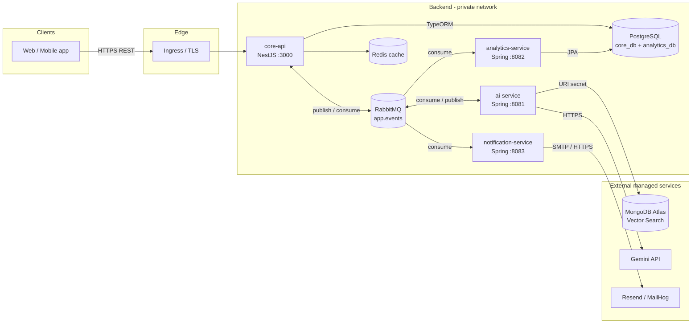
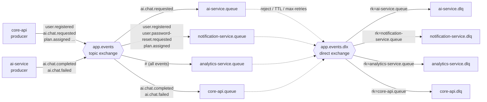
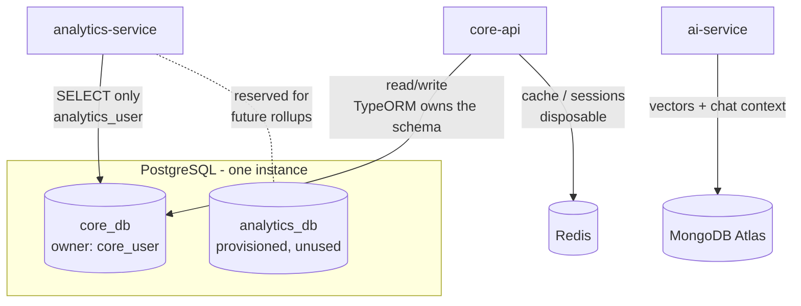
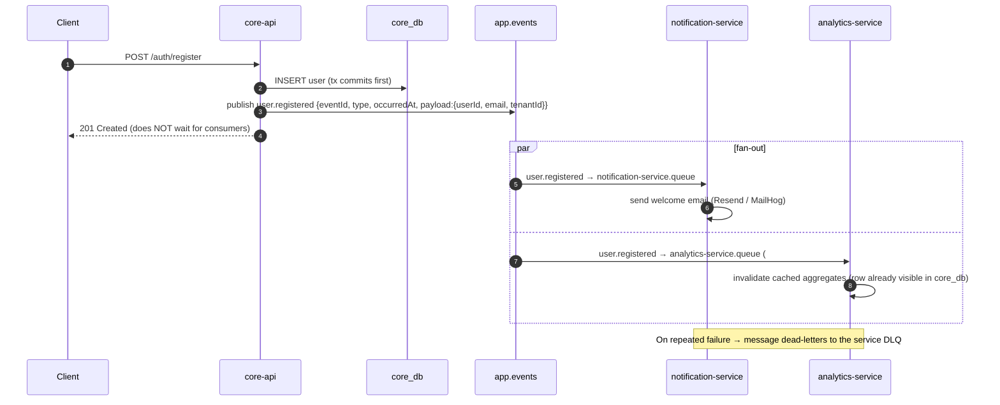

# CoachHub — System Architecture

> Deliverable 1 of 4. Companion
> docs: [Docker deployment](02-docker-deployment.md) ·
> [Kubernetes deployment](03-kubernetes-deployment.md) · [Final deployment architecture](04-deployment-architecture.md) ·
> [Azure runbook](05-azure-deployment.md)

> **Implemented reality (2026-07-10):** the deployable assets now live in the repo —
> root `docker-compose.yml` (+ `docker-compose.override.yml`, `.env.example`),
> `deploy/docker/create-databases.sh`, and AKS-ready manifests in `deploy/k8s/`.
> Where the codebase differs from the idealized names in these docs, **the code wins**:
> exchange is `coachhub.events` (DLX `coachhub.events.dlx`); queues are `ai.q`,
> `notification.q`, `analytics.q` (+ `.dlq` each) and `core-api.ai-completed.q`;
> routing keys include `client.invited`, `plan.assigned`, `ai.requested`,
> `ai.completed`; the envelope is
> `{ tenantId, correlationId, messageType, timestamp, schemaVersion, payload }`
> (correlationId serves the eventId/idempotency role). Ports: **8082 = analytics,
> 8083 = notification** (repo convention kept).

## 1. Overview

CoachHub is a multi-tenant fitness-coaching SaaS. The backend is 4 services
communicating
**asynchronously over RabbitMQ**. `core-api` is the **only** synchronous,
client-facing entry
point; the three Spring services are never reachable by clients.

| Service              | Stack                 | Port  | Data store                        | Role                                             |
|----------------------|-----------------------|-------|-----------------------------------|--------------------------------------------------|
| core-api             | NestJS (TS), TypeORM  | 3000  | PostgreSQL `core_db`, Redis       | Client-facing REST API, publishes domain events  |
| ai-service           | Spring Boot (Java 21) | 8081  | MongoDB Atlas (managed, URI only) | RAG pipeline, Gemini calls, MQ consumer/producer |
| notification-service | Spring Boot (Java 21) | 8083  | none (stateless)                  | Email (MailHog dev / Resend prod), MQ consumer   |
| analytics-service    | Spring Boot (Java 21) | 8082  | PostgreSQL `core_db` (read-only)  | Reporting over core-api's live data, MQ consumer |

Ports follow the repo convention: 8081 ai / 8082 analytics / 8083 notification —
compose, K8s manifests, and each service's `application.yml` all agree.

### Locked architectural decisions

1. **Analytics reports on core-api's live data** — `analytics-service` connects
   to `core_db` as `analytics_user` with **SELECT and nothing else**. Postgres
   cannot join across databases, so reporting on core-api's data means
   connecting to that database, not copying rows into another one. Consequences:
   Hibernate runs `ddl-auto=none` (TypeORM owns every table it reads), the
   Hikari pool is capped and marked read-only, and analytics has no schema of
   its own to keep in sync. `analytics_db` stays provisioned but unused —
   available if precomputed rollups are ever needed, at which point the service
   takes a second datasource rather than moving its source of truth.
2. **MongoDB Atlas is fully managed** — never deployed in-cluster; only a URI
   secret is injected.
3. **RabbitMQ**: single topic exchange `app.events`, one durable queue per
   consumer, each with a
   DLQ via `x-dead-letter-exchange`. Routing keys `<domain>.<action>`.
4. **Ingress exposes core-api only.** Spring services are ClusterIP-only.
5. **Redis is a disposable cache** — plain Deployment, no persistence.

## 2. Service graph



Key properties:

- All inter-service communication is **async via `app.events`** — no service
  calls another over HTTP.
- Only `core-api` touches Redis. `core-api` and `analytics-service` both connect
  to `core_db`, through **separate users with different privileges** — `core_user`
  read/write, `analytics_user` SELECT only.

## 3. RabbitMQ topology

Single durable **topic** exchange `app.events`. One durable queue per consumer
service. Every
queue declares `x-dead-letter-exchange: app.events.dlx` and
`x-dead-letter-routing-key: <its-own-queue-name>`; the DLX is a **direct**
exchange so each DLQ
receives only its own dead letters.



### Bindings

| Queue                        | Binding keys                                                        | Consumer             | Notes                                                                                               |
|------------------------------|---------------------------------------------------------------------|----------------------|-----------------------------------------------------------------------------------------------------|
| `ai-service.queue`           | `ai.chat.requested`                                                 | ai-service           | Never bind `ai.#` — the service also *publishes* `ai.chat.completed`, a wildcard would loop it back |
| `notification-service.queue` | `user.registered`, `user.password-reset.requested`, `plan.assigned` | notification-service | Extend per notification type                                                                        |
| `analytics-service.queue`    | `#`                                                                 | analytics-service    | No longer builds state — analytics reads `core_db` directly. Retained for cache invalidation / live dashboard push |
| `core-api.queue`             | `ai.chat.completed`, `ai.chat.failed`                               | core-api             | Reply channel for async AI work                                                                     |

All queues: `durable: true`, `x-dead-letter-exchange: app.events.dlx`,
`x-dead-letter-routing-key: <queue-name>`. DLQs are plain durable queues bound
to
`app.events.dlx` by their owner queue's name.

### Event envelope (JSON, on every message)

```json
{
    "eventId": "9f6b2c8e-1c1a-4f7e-9b8a-2f1d3e4a5b6c",
    "type": "user.registered",
    "occurredAt": "2026-07-04T12:34:56.789Z",
    "payload": {}
}
```

Rules: `eventId` is a UUID v4 used for **consumer-side idempotency** (analytics
and notification
must dedupe on it — at-least-once delivery is the contract); `type` equals the
routing key;
`occurredAt` is ISO-8601 UTC; `payload` is event-specific and versioned
additively (never remove
fields — add new ones).

## 4. Data ownership



| Store          | Owner    | Access rule                                                                                  |
|----------------|----------|----------------------------------------------------------------------------------------------|
| `core_db`      | core-api | `core_user` read/write, schema via TypeORM. `analytics_user` holds **SELECT only**            |
| `analytics_db` | —        | Provisioned but unused. Reserved for precomputed rollups if on-the-fly aggregation gets slow  |
| MongoDB Atlas  | ai-service | Managed; connection string only                                                             |
| Redis          | core-api | Cache/sessions; losing it must never lose business data                                       |

Two properties keep this safe. `analytics_user` is never granted
INSERT/UPDATE/DELETE on `core_db`, and the Hikari pool is marked `read-only`, so
a bug in analytics cannot corrupt business data. And `ALTER DEFAULT PRIVILEGES
FOR ROLE core_user` in the init script means tables core-api creates later are
readable automatically — without it, a schema change would silently break
reporting.

The cost is that analytical queries share an instance with the latency-sensitive
OLTP workload, which is why the analytics pool is capped well below core-api's.
If that contention ever bites, the fix is a streaming read replica and a
connection-string change — not a return to copying rows.

## 5. Example event flows

### 5.1 User registration



### 5.2 AI chat request/reply (fully async over MQ)

```mermaid
sequenceDiagram
    autonumber
    participant C as Client
    participant API as core-api
    participant MQ as app.events
    participant AI as ai-service
    participant AT as MongoDB Atlas
    participant G as Gemini API

    C->>API: POST /ai/chat {conversationId, message}
    API->>API: persist message, status=PENDING (core_db)
    API->>MQ: publish ai.chat.requested {payload:{conversationId, messageId, userId, message}}
    API-->>C: 202 Accepted {messageId}
    MQ->>AI: ai.chat.requested → ai-service.queue
    AI->>AT: vector search (RAG context)
    AI->>G: generate answer (HTTPS)
    AI->>MQ: publish ai.chat.completed {payload:{messageId, answer, usage}}
    MQ->>API: ai.chat.completed → core-api.queue
    API->>API: persist answer, status=DONE
    API-->>C: deliver via WebSocket/SSE (or client polls GET /ai/chat/:messageId)
    Note over AI,MQ: On failure → publish ai.chat.failed; after max retries the request dead-letters to ai-service.dlq
```

**Assumption stated:** client reply delivery is WebSocket/SSE-or-polling from
core-api; the
Spring services never talk to clients (locked decision #4).

## 6. Failure & delivery semantics (summary)

| Concern                    | Mechanism                                                                      |
|----------------------------|--------------------------------------------------------------------------------|
| Broker restart             | Durable exchange + durable queues + persistent messages (`deliveryMode=2`)     |
| Consumer crash mid-message | Manual ack after processing → redelivery                                       |
| Poison message             | Bounded retries, then `basic.reject(requeue=false)` → DLX → per-service DLQ    |
| Duplicate delivery         | At-least-once; consumers dedupe on `eventId`                                   |
| DB not ready at startup    | Apps retry connections with backoff (mandatory in K8s — no `depends_on` there) |
