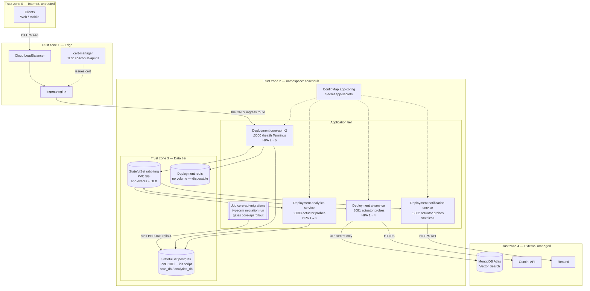

# CoachHub — Final Deployment Architecture

> Deliverable 4 of 4. Synthesis of [architecture](01-system-architecture.md),
> [Docker](02-docker-deployment.md) and [Kubernetes](03-kubernetes-deployment.md).
> Azure-specific setup lives in the [Azure runbook](05-azure-deployment.md).

> **Implemented (2026-07-10):** canonical manifests are in `deploy/k8s/` (AKS:
> `managed-csi` storage, ACR images). Naming deltas vs. the diagrams below — exchange
> `coachhub.events`, queues `ai.q` / `analytics.q` / `notification.q` /
> `core-api.ai-completed.q`, ports 8082 = analytics / 8083 = notification.

## 1. Full Kubernetes topology

### Trust zones

| Zone | Contents | Ingress allowed from | Egress allowed to |
|---|---|---|---|
| 0 Internet | Clients | — | Edge (443) |
| 1 Edge | LB, ingress-nginx, cert-manager | Internet :443 | core-api Service only |
| 2 Apps | 4 Deployments + migration Job | Edge → core-api **only**; Spring services: nothing external | Data tier; Zone 4 (ai, notif only) |
| 3 Data | Postgres, RabbitMQ, Redis | App tier only | none |
| 4 External | Atlas, Gemini, Resend | app egress (TLS + credentials) | — |

Enforce zone boundaries with NetworkPolicies (default-deny + explicit allows) — listed as a
hardening upgrade in Deliverable 3 §11. Even without them, the design already guarantees:
no Ingress for Spring services, per-DB Postgres users, Atlas/Gemini/Resend reachable only with
injected secrets.

## 2. Compose vs Kubernetes environment matrix

| Concern | Docker Compose (dev) | Kubernetes (staging/prod) |
|---|---|---|
| Purpose | Local dev, integration testing | Real traffic |
| Startup ordering | `depends_on: service_healthy` | **None** — apps retry connections; startupProbes; migration Job gates core-api |
| core-api exposure | `localhost:3000` | Ingress + TLS (cert-manager), `api.coachhub.example.com` |
| Spring services | Host ports 8081–8083 (debug convenience) | **ClusterIP only, no external route** |
| Postgres | Container + named volume, init script | StatefulSet + PVC + init ConfigMap → managed RDS/Cloud SQL later |
| Two logical DBs | Same `create-databases.sh` | Same script via ConfigMap — identical contract |
| TypeORM schema | Migrations run manually (`compose run`) | Migration **Job** before rollout; `synchronize: false` everywhere non-local |
| RabbitMQ | Single container + volume | StatefulSet → Cluster Operator + quorum queues later |
| Redis | Container, no volume | Deployment, no PVC (locked: disposable) |
| Email | MailHog (`:8025` UI) | Resend API (`RESEND_API_KEY`) |
| MongoDB | Atlas URI from `.env` | Atlas URI from Secret — never in-cluster (locked) |
| Secrets | `.env` file (gitignored) | Secret → Sealed/External Secrets in real prod |
| Scaling | none (`--scale` at best) | HPA now, KEDA on queue depth later |
| Health usage | compose healthcheck gates `depends_on` | liveness=restart, readiness=traffic, startup=slow boot |
| Images | Built locally, `IMAGE_TAG=dev` | Pulled from GHCR, **immutable SHA/semver tags** |
| Hot reload | `docker-compose.override.yml` | never — immutable images only |

## 3. CI/CD pipeline

```mermaid
flowchart LR
    DEV[git push / PR] --> CI

    subgraph CI [CI — per service, path-filtered]
        LINT[lint + unit tests] --> BUILD[docker build<br/>multi-stage]
        BUILD --> SCAN[Trivy scan]
        SCAN --> PUSH[push ghcr.io/org/svc:GIT_SHA<br/>immutable tag]
    end

    PUSH --> CDS

    subgraph CDS [CD — staging, auto on main]
        APPLY1[apply config] --> MIG1[migration Job<br/>kubectl wait complete]
        MIG1 --> ROLL1[set image + rollout status<br/>all 4 services]
        ROLL1 --> SMOKE[smoke tests<br/>/health + one async event round-trip]
    end

    SMOKE --> GATE{manual approval<br/>+ git tag vX.Y.Z}

    subgraph CDP [CD — production]
        GATE --> MIG2[migration Job] --> ROLL2[rolling deploy<br/>maxUnavailable: 0]
        ROLL2 --> VERIFY[verify: /health 200,<br/>DLQ depth 0, error rate flat]
        VERIFY -->|regression| RB[kubectl rollout undo<br/>images immutable → exact rollback]
    end
```

Pipeline rules:

1. **Tag = git SHA** for every image; a release re-tags the same digest as `vX.Y.Z`. Never
   `:latest`, never tag reuse — rollback is then just "point back at the previous digest".
2. **Migrations always run before the app rollout**, from the same image tag being deployed
   (Deliverable 3 §5). TypeORM migrations must be backward-compatible one version (expand →
   deploy → contract) so old pods can serve during the rolling update.
3. Deploys are `kubectl apply` + `kubectl set image` from CI today; upgrade path is Kustomize
   overlays per env, then Argo CD (migration Job as a pre-sync hook).
4. Rollback: `kubectl rollout undo deployment/<svc>` — schema is never auto-reverted; write
   down migrations only for deliberate, tested rollbacks.

## 4. Recommended first-deploy rollout order

Why this order: infra has no dependencies; **databases must exist before migrations**
(TypeORM cannot create them — the init script does); migrations must finish before core-api;
**consumers start before the producer** so no event published by core-api is ever dropped for
lack of a bound queue; ingress goes live only when core-api is Ready.

| # | Step | Command / check | Gate before next step |
|---|---|---|---|
| 1 | Namespace + config | `kubectl apply -f 00-namespace.yaml -f 10-config/` | secrets present (`kubectl -n coachhub get secret app-secrets`) |
| 2 | Data tier | `kubectl apply -f 20-data/` | `rollout status` on postgres, rabbitmq, redis all Ready |
| 3 | Verify DBs created | `kubectl -n coachhub exec postgres-0 -- psql -U postgres -c '\l'` | `core_db` and `analytics_db` listed (init script ran) |
| 4 | TypeORM migrations | apply Job → `kubectl wait --for=condition=complete job/core-api-migrations` | Job **Complete** (not just started) |
| 5 | Consumers | apply ai-service, notification-service, analytics-service | all Ready; queues + DLQs visible in RabbitMQ mgmt UI (`port-forward svc/rabbitmq 15672`) |
| 6 | Producer | apply core-api | Ready 2/2; `/health` 200 via `port-forward` |
| 7 | Ingress + TLS | apply 50-ingress/ | cert `Ready=True` (`kubectl get certificate`), `curl https://api.…/health` → 200 |
| 8 | Autoscaling | apply 60-autoscaling/ | `kubectl get hpa` shows real metrics, not `<unknown>` |
| 9 | End-to-end smoke | register a test user | welcome email sent (Resend log), analytics row written, **all DLQs empty** |

> Steps 4–6 are the standing deploy sequence for every future release (migrate → consumers →
> producer). Steps 1–3, 7–8 are bootstrap-only.

## 5. Standing production-upgrade register

Consolidated from all deliverables — the delta between "works" and "production-grade":

1. **KEDA** queue-depth autoscaling for the three MQ consumers (CPU HPAs are a stopgap).
2. **Managed PostgreSQL** (RDS/Cloud SQL) — the two-logical-DB locked design makes this a
   connection-string-only migration; also the sanctioned path to later split analytics onto its
   own instance.
3. **RabbitMQ Cluster Operator**, 3 nodes, **quorum queues** replacing the single StatefulSet.
4. **NetworkPolicies** implementing the trust-zone table (§1) as default-deny rules.
5. **PodDisruptionBudgets** (core-api minAvailable 1; data tier maxUnavailable 0) +
   topologySpreadConstraints across zones.
6. **Sealed Secrets / External Secrets Operator**; immediately **rotate the Atlas credentials**
   currently committed in the repo's `docker-compose.yml`.
7. Observability: Prometheus (`/actuator/prometheus`), Grafana, OTel tracing keyed on
   `eventId`; **alert on any DLQ depth > 0** — a non-empty DLQ is a paged incident, not noise.
8. Supply chain: Trivy scan + cosign signing in CI; admission policy rejecting unsigned images.
